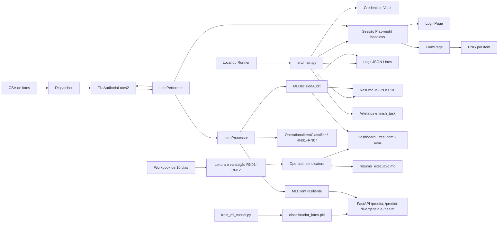

# Conferência de Lotes

[](https://github.com/g-f307/conferencia-de-lotes/actions/workflows/ci.yml)

Automação corporativa para conferência de registros de inspeção, com
processamento resiliente por item, integração com BotCity Maestro e automação
web controlada por Playwright.

## Visão geral

O fluxo combina Dispatcher, DataPool, Performer, Credentials Vault, Page
Objects, evidências visuais e observabilidade:

1. o Dispatcher lê `dados_entrada/lotes_auditoria.csv` e publica uma entrada
   por linha no DataPool `FilaAuditoriaLotes2`;
2. a credencial `credencial_erp2` é recuperada do Credentials Vault;
3. uma sessão Playwright headless autentica uma única vez na aplicação local;
4. o Performer consome a fila e processa cada lote isoladamente;
5. as regras RN01–RN07 determinam aprovação, reprovação, divergência ou
   revisão;
6. `LoginPage` e `FormPage` executam a interação web correspondente ao item;
7. o resultado, a mensagem e o caminho da captura são gravados no DataPool
   antes da finalização do item;
8. logs JSON Lines, resumo JSON e relatório PDF consolidam a execução.

Uma inconsistência ou falha web em um lote não interrompe os demais itens. Uma
falha anterior ao consumo, como configuração, entrada ou credencial inválida,
encerra a execução imediatamente.

## Objetivo

Executar a conferência de lotes de forma:

- resiliente, isolando falhas por item;
- rastreável, com resultado e evidência associados ao lote;
- segura, sem credenciais no código, no `.env` ou nos logs;
- reproduzível nos modos local, Docker e BotCity Runner;
- manutenível, separando regras, orquestração e interface por Page Objects;
- auditável, com logs estruturados e resultados consolidados.

## Escopo

Estão implementados:

- configuração externa e caminhos relativos;
- fail-fast da pasta `dados_entrada/`;
- Dispatcher de CSV por cabeçalho;
- DataPool local ou BotCity Maestro;
- validações RN01–RN07;
- recuperação da credencial pelo Vault;
- Playwright síncrono com Chromium headless;
- Page Objects com locators semânticos e waits por condição;
- processamento web e captura de PNG por item;
- continuidade após divergência, revisão ou falha técnica isolada;
- campos de saída no DataPool;
- logs estruturados no arquivo e no console;
- resumo JSON, relatório PDF, artefatos e `finish_task`;
- pacote ZIP para o BotCity Runner;
- Docker e integração contínua;
- relatório executivo Excel com dashboard, gráficos nativos e validação
  RN01–RN12.

## Fora do escopo

Não fazem parte desta versão:

- captura de anexos de e-mail;
- acesso ou atualização de ERP produtivo;
- armazenamento de credenciais reais no repositório;
- interface para resolução dos itens encaminhados à revisão;
- execução distribuída de navegadores;
- alteração automática da base de referência.

`web/index-lotes/` é uma aplicação controlada, destinada somente à
demonstração e à produção de evidências. Nenhum sistema real é acessado.

## Processo de negócio


O modelo editável está em
[`docs/diagrama_pdd.bpmn`](docs/diagrama_pdd.bpmn). A relação entre o processo,
as regras e o código está registrada em
[`docs/REVISAO_BPMN_PDD.md`](docs/REVISAO_BPMN_PDD.md).

## Arquitetura



As responsabilidades principais são:

| Componente | Responsabilidade |
|---|---|
| `src/main.py` | Validar o ambiente e coordenar Vault, Playwright, Dispatcher, Performer e encerramento. |
| `src/dispatcher.py` | Publicar uma entrada por linha e reservar os campos de saída. |
| `src/bot.py` | Classificar, processar e finalizar cada item de forma isolada. |
| `src/validation.py` | Aplicar RN01–RN07 sem dependência da interface. |
| `src/web_automation.py` | Gerenciar o ciclo da sessão Playwright e a evidência por item. |
| `src/pages/login_page.py` | Encapsular autenticação, locators e waits. |
| `src/pages/form_page.py` | Encapsular o formulário, a confirmação e a captura visual. |
| `src/maestro_client.py` | Adaptar DataPool, alertas, artefatos e task. |
| `src/vault_client.py` | Recuperar e validar a credencial somente em memória. |
| `src/excel_reporting/service.py` | Orquestrar leitura, validação, cálculo único dos indicadores e publicação conjunta das saídas analíticas. |
| `src/operational_indicators.py` | Consolidar os 10 indicadores operacionais sem dependência de Excel, disco ou interface. |
| `src/excel_reporting/report_writer.py` | Transformar registros validados, indicadores e decisões de ML no workbook executivo de 9 abas. |
| `src/markdown_reporting.py` | Transformar o mesmo objeto de indicadores no resumo gerencial em Markdown. |
| `scripts/train_ml_model.py` | Gerar dados fictícios, treinar o Random Forest e serializar o pipeline. |
| `api_ml/main.py` | Servir `/predict`, `/predict-divergencia` e `/health`, com contrato textual substituível por modelo ou mock controlado. |
| `src/item_processor.py` | Preservar a decisão determinística e complementar somente casos ambíguos com ML. |
| `src/reference_base.py` | Isolar a consulta à Base de Referência e diferenciar infraestrutura de dados. |
| `src/retry_policy.py` | Aplicar retry com backoff linear, timeout e relógio injetável. |
| `src/dead_letter.py` | Persistir falhas repetidas de dados em JSON Lines sanitizado, idempotente e protegido por lock multiplataforma. |
| `src/alerts.py` | Entregar alertas por Telegram, Email e log local sem bloquear o pipeline. |
| `src/ml_client.py` | Consumir a API com timeout, validação de contrato, fallback e circuit breaker. |
| `src/ml_audit.py` | Criar a fonte tipada compartilhada pelo log, resumo JSON e aba `Decisões de ML`. |

Detalhes e diagramas de sequência estão em
[`docs/ARQUITETURA.md`](docs/ARQUITETURA.md).

## Fluxo de execução

1. `bot.py` carrega o ambiente e os argumentos opcionais do Runner.
2. `Settings.validate()` valida configuração, caminhos e timeout.
3. A ausência de `dados_entrada/` causa falha imediata e alerta no Maestro.
4. O Vault é validado antes da criação ou do consumo de itens.
5. Quando habilitada, a sessão Playwright inicia em modo headless e
   `LoginPage.fazer_login()` utiliza a credencial recuperada.
6. O Dispatcher publica o CSV no DataPool.
7. O Performer obtém um item e valida RN01/RN02 antes de consultar a Base de
   Referência pela abstração `ReferenceBaseService`.
8. Falhas de infraestrutura são repetidas com backoff linear. Se a base
   continuar indisponível, o item fica como `PENDENTE_REVISAO`, um alerta
   operacional é solicitado e o lote continua.
9. Uma falha repetida de dados gera uma única linha sanitizada em
   `data/output/dead_letter.jsonl`. Indisponibilidade de infraestrutura e ML
   nunca são enviadas ao dead letter.
10. A RN03 recebe somente o resultado encontrado/não encontrado. O ML pode
    complementar causa e confiança, mas nunca altera o status determinístico.
11. Indisponibilidade da API gera `REVISAO_ML_OFFLINE`, finaliza o item com os
    outputs de revisão sem `report_error` e não interrompe os itens seguintes.
    Cada predição ou fallback produz exatamente um `MLDecisionAudit`, inclusive
    quando o circuit breaker já está aberto.
12. `FormPage.preencher_lote()` apresenta o resultado do item na aplicação
   controlada e aguarda a confirmação.
13. Uma captura `aprovado-*`, `reprovado-*`, `divergencia-*` ou `erro-*` é
   produzida.
14. `resultado_validacao`, `evidencia` e `mensagem_resultado` são atualizados no
    DataPool antes de `report_done` ou `report_error`.
15. O loop continua até o fim da fila.
16. O resumo e o PDF são publicados, e a task é finalizada.
17. Página, navegador e runtime Playwright são encerrados em `finally`.

Não existem `sleep()` para sincronização da interface. A camada web aguarda
condições explícitas de visibilidade, disponibilidade e confirmação.

### Fronteira das regras determinísticas

O projeto possui dois contratos determinísticos deliberadamente separados:

- o Performer e o DataPool mantêm RN01–RN07, inclusive os formatos e resultados
  operacionais já homologados;
- a consolidação analítica do Excel mantém RN01–RN12, incluindo contexto de aba,
  duplicidade diária e data no formato `DD/MM/AAAA`.

O `ItemProcessor` não reimplementa nenhuma dessas regras. Ele recebe uma
`ItemClassification` de um `DeterministicClassifier` e complementa apenas o
resultado `REVISAO`. O adaptador padrão é `OperationalItemClassifier`; outro
fluxo pode injetar sua decisão determinística sem modificar o cliente ML. Essa
fronteira evita alterar RN01–RN12 ou as classificações operacionais existentes.

### Fluxo analítico Excel e Markdown

O fluxo acionado por `gerar_relatorio.py` é independente da automação web:

1. lê as abas diárias e a Base de Referência do workbook;
2. aplica RN01–RN12 e define `classificacao` e `regra_aplicada`;
3. ordena os registros de forma determinística;
4. chama `calcular_indicadores()` exatamente uma vez;
5. entrega a mesma instância de `OperationalIndicators` aos geradores Excel e
   Markdown;
6. gera as duas saídas em arquivos temporários;
7. publica os artefatos finais somente após as duas gerações terminarem com
   sucesso;
8. grava no log as contagens, taxas, regra mais acionada e ganho estimado.

Essa fonte única de verdade impede que o Dashboard e o resumo textual
recalculem percentuais por caminhos diferentes.

## Regras de validação

| Regra | Comportamento |
|---|---|
| RN01 | Reconhece somente os campos oficiais do lote e os três campos operacionais de saída. |
| RN02 | Exige todos os campos de entrada, exceto `observacao`. |
| RN03 | Confirma que `lote_id` pertence a `REFERENCE_LOTES`. |
| RN04 | Aceita como estados finais apenas `APROVADO` e `REPROVADO`. |
| RN05 | Normaliza `OK` para `APROVADO` e `NOK` para `REPROVADO`. |
| RN06 | Encaminha estados ambíguos para revisão humana. |
| RN07 | Exige observação quando o lote está reprovado. |

As regras permanecem em `src/validation.py`. Os Page Objects apenas representam
a interface e não decidem o resultado do negócio.

### Validação RN01-RN12 para relatórios

`src/excel_reporting/` contém a implementação de leitura e consolidação de planilhas. Ele produz `RegistroValidado`, aceita `PENDENTE` e acumula todas as regras violadas antes de atribuir uma única classificação.

A precedência é `Erro de Entrada > Divergência > Ambíguo > Válido`. Esse
serviço não é importado pelo Performer e não altera as RN01-RN07 aplicadas ao
DataPool.

## Resultados por item

| `resultado_validacao` | Finalização | Evidência |
|---|---|---|
| `APROVADO` | `report_done` | `artefatos/aprovado-<lote>-<timestamp>.png` |
| `REPROVADO` | `report_done` | `artefatos/reprovado-<lote>-<timestamp>.png` |
| `DIVERGENCIA` | erro de negócio | `artefatos/divergencia-<lote>-<timestamp>.png` |
| `REVISAO` | erro de negócio com motivo de revisão | `artefatos/divergencia-<lote>-<timestamp>.png` |
| `ERRO` | erro de sistema | `artefatos/erro-<lote>-<timestamp>.png`, quando a captura for possível |

`REPROVADO` é um resultado final válido das regras RN01–RN07. Ele não é
contabilizado como divergência nem como falha da automação.

O caminho gravado no DataPool, no log e no resumo é relativo à raiz do projeto,
o que evita referências específicas de uma máquina ou Runner.

## Estrutura do projeto

```text
.
├── .github/workflows/ci.yml
├── artefatos/                     # PNG e PDF gerados em runtime
├── api_ml/
│   ├── Dockerfile                 # imagem isolada do serviço de ML
│   ├── main.py                    # API FastAPI e contrato de predição
│   └── requirements.txt
├── dados_entrada/
│   ├── lotes_auditoria.csv
│   └── inspecao_lotes_10dias.xlsx  # workbook de 10 dias (Aula 22)
├── dados_ml/
│   └── historico_lotes.csv        # dataset fictício reproduzível
├── docs/
│   ├── ADERENCIA_PAGE_OBJECTS.md
│   ├── ARQUITETURA.md
│   ├── DEPLOY_BOTCITY.md
│   ├── EXECUCAO_E2E_DOCKER_CI.md
│   ├── CHECKLIST_FINAL_ACEITE_AULA24.md
│   ├── HOMOLOGACAO_TESTES_AULA23.md
│   ├── RELATORIO_EXCEL_AULA22.md
│   ├── RELEASE_V1.6.0.md
│   ├── REVISAO_BPMN_PDD.md
│   ├── ROTEIRO_APRESENTACAO_AULA22.md
│   ├── ROTEIRO_DEMONSTRACAO.md
│   ├── diagrama_pdd.bpmn
│   └── diagrama_pdd.svg
├── logs/                          # JSON Lines gerado em runtime
├── data/output/                   # dead_letter.jsonl gerado em runtime
├── models/
│   └── classificador_lotes.pkl    # pipeline Random Forest serializado
├── relatorios/                    # JSON, PDF e XLSX gerados em runtime
├── scripts/
│   ├── build_botcity_package.py
│   └── train_ml_model.py
├── src/
│   ├── excel_reporting/
│   │   ├── __init__.py
│   │   ├── models.py
│   │   ├── report_writer.py
│   │   ├── service.py
│   │   ├── validation_service.py
│   │   └── workbook_reader.py
│   ├── pages/
│   │   ├── login_page.py
│   │   └── form_page.py
│   ├── bot.py
│   ├── config.py
│   ├── dead_letter.py
│   ├── dispatcher.py
│   ├── logging_config.py
│   ├── maestro_client.py
│   ├── main.py
│   ├── orchestrator.py
│   ├── wait_for_predecessor.py
│   ├── markdown_reporting.py
│   ├── models.py
│   ├── operational_indicators.py
│   ├── reference_base.py
│   ├── retry_policy.py
│   ├── reporting.py
│   ├── validation.py
│   ├── vault_client.py
│   └── web_automation.py
├── tests/
│   └── e2e/                       # cenários reais com pytest-playwright
├── web/index-lotes/               # aplicação controlada
├── .env.example
├── bot.py
├── gerar_relatorio.py             # entry point do relatório Excel
├── Dockerfile
├── docker-compose.yml
├── requirements.txt
├── requirements-dev.txt
├── requirements-report.txt        # dependências do relatório Excel
└── CHANGELOG.md                    # histórico versionado das entregas
```

`.env`, logs, relatórios, PNG, pacotes e caches não são versionados. Os
diretórios operacionais mantêm somente seus arquivos `.gitkeep`.

## Pré-requisitos

- Python 3.10 ou superior;
- Git;
- Chromium fornecido pelo Playwright ou instalado no ambiente;
- para integração real, workspace e Runner ativos no BotCity Maestro.

O ambiente do Maestro deve possuir:

- DataPool `FilaAuditoriaLotes2`;
- credencial `credencial_erp2`;
- permissão para alertas, artefatos e finalização de tasks.

## Instalação

```bash
git clone https://github.com/g-f307/conferencia-de-lotes.git
cd conferencia-de-lotes
python -m venv .venv
source .venv/bin/activate
python -m pip install -r requirements-dev.txt
python -m playwright install --with-deps --only-shell chromium
cp .env.example .env
```

No PowerShell:

```powershell
python -m venv .venv
.venv\Scripts\Activate.ps1
python -m pip install -r requirements-dev.txt
python -m playwright install --only-shell chromium
Copy-Item .env.example .env
```

`requirements-dev.txt` instala `pytest-playwright`. O comando seguinte instala
o Chromium Headless Shell usado pelos testes; `--with-deps` também prepara as
bibliotecas do sistema em distribuições Linux compatíveis. A instalação do
bundle é dispensável quando `PLAYWRIGHT_CHROMIUM_PATH` aponta para um Chromium
compatível já instalado.

## Variáveis de ambiente

| Variável | Finalidade | Padrão |
|---|---|---|
| `MAESTRO_ENABLED` | Ativa o gateway BotCity. | `false` |
| `VAULT_ENABLED` | Exige o Credentials Vault. | `false` |
| `MAESTRO_SERVER` | URL do workspace fora do Runner. | vazio |
| `MAESTRO_LOGIN` | Login técnico fora do Runner. | vazio |
| `MAESTRO_KEY` | Chave técnica fora do Runner. | vazio |
| `MAESTRO_TASK_ID` | Task controlada fora do Runner. | vazio |
| `BOT_ID` | Identificador da automação. | `bot-conferencia-de-lotes-v2` |
| `EXECUTION_ID` | Correlação dos logs. | `execucao-local` |
| `ORCHESTRATION_ENABLED` | Ativa a cadeia de três bots no Maestro. | `false` |
| `ORCHESTRATION_TIMEOUT_SECONDS` | Limite para aguardar o predecessor. | `300` |
| `ORCHESTRATION_POLL_INTERVAL_SECONDS` | Intervalo entre consultas de task. | `2` |
| `DATAPOOL_LABEL` | Nome da fila. | `FilaAuditoriaLotes2` |
| `VAULT_LABEL` | Nome da credencial. | `credencial_erp2` |
| `REFERENCE_LOTES` | IDs de referência separados por vírgula. | `L001,L002` |
| `REFERENCE_MAX_ATTEMPTS` | Máximo de tentativas da Base de Referência. | `3` |
| `REFERENCE_RETRY_BASE_INTERVAL_SECONDS` | Base do backoff linear entre tentativas. | `1` |
| `REFERENCE_TIMEOUT_SECONDS` | Timeout repassado para cada consulta. | `5` |
| `DEAD_LETTER_PATH` | Falhas repetidas de dados para reprocessamento. | `data/output/dead_letter.jsonl` |
| `ALERTS_ENABLED` | Ativa Telegram, Email e fallback local. | `false` |
| `TELEGRAM_BOT_TOKEN` | Token sigiloso do bot Telegram. | vazio |
| `TELEGRAM_CHAT_ID` | Destino sigiloso do Telegram. | vazio |
| `TELEGRAM_API_BASE_URL` | Endpoint base do Telegram. | `https://api.telegram.org` |
| `SMTP_HOST` | Servidor do canal de Email. | vazio |
| `SMTP_PORT` | Porta SMTP. | `587` |
| `SMTP_USERNAME` | Usuário técnico sigiloso, quando exigido. | vazio |
| `SMTP_PASSWORD` | Senha SMTP sigilosa. | vazio |
| `SMTP_FROM` | Remetente autorizado. | vazio |
| `SMTP_TO` | Destinatários sigilosos separados por vírgula. | vazio |
| `SMTP_USE_TLS` | Ativa STARTTLS no SMTP. | `true` |
| `ALERTS_TIMEOUT_SECONDS` | Timeout individual dos canais. | `5` |
| `INPUT_DIR` | Diretório validado no fail-fast. | `dados_entrada` |
| `INPUT_CSV` | Massa publicada pelo Dispatcher. | `dados_entrada/lotes_auditoria.csv` |
| `LOG_FILE` | Log JSON Lines. | `logs/execucao.log` |
| `REPORT_DIR` | Resumo e PDF. | `relatorios` |
| `PROCESSING_DELAY_SECONDS` | Atraso de demonstração após aprovação. | `0` |
| `WEB_AUTOMATION_ENABLED` | Ativa a sessão Playwright. | `false` local |
| `WEB_TEST_URL` | Aplicação controlada. | `web/index-lotes/index.html` |
| `WEB_ARTIFACT_DIR` | Capturas por item. | `artefatos` |
| `WEB_TIMEOUT_SECONDS` | Timeout dos waits por condição. | `15` |
| `PLAYWRIGHT_CHROMIUM_PATH` | Chromium explícito do Runner. | vazio |
| `ML_MODEL_PATH` | Artefato carregado pela API de ML. | `models/classificador_lotes.pkl` |
| `ML_API_PORT` | Porta da API de ML publicada pelo Docker Compose. | `8000` |
| `ML_ENABLED` | Ativa a consulta de ML para casos ambíguos elegíveis. | `false` |
| `ML_API_URL` | URL base da API consumida pelo bot. | `http://127.0.0.1:8000` local |
| `ML_TIMEOUT_SECONDS` | Timeout explícito de cada chamada à API. | `3` |
| `ML_CONFIANCA_MINIMA` | Limiar mínimo para aceitar a causa sugerida a partir da observação. | `0.85` |

Caminhos relativos são resolvidos a partir da raiz do projeto. A senha do ERP
não é uma variável de ambiente deste projeto. Tokens e senhas dos canais de
alerta são carregados apenas do ambiente e nunca devem ser versionados.

## Operação resiliente S10-B

### Ligar e desligar o ML

O ML é complementar e atua somente nos casos ambíguos elegíveis. A decisão de
negócio continua sendo calculada pelas regras determinísticas mesmo quando a
API está desabilitada ou indisponível.

Para executar sem ML:

```bash
ML_ENABLED=false python bot.py
```

Para executar localmente com ML, inicie a API em um terminal:

```bash
uvicorn api_ml.main:app --host 127.0.0.1 --port 8000
```

Em outro terminal, configure o endpoint, o timeout e o limite de confiança:

```bash
ML_ENABLED=true \
ML_API_URL=http://127.0.0.1:8000 \
ML_TIMEOUT_SECONDS=3 \
ML_CONFIANCA_MINIMA=0.85 \
python bot.py
```

Uma predição abaixo de `ML_CONFIANCA_MINIMA`, uma resposta inválida, um timeout
ou uma indisponibilidade produz `origem_decisao=fallback`. A causa passa a
`nao_classificado`, o motivo é auditado e o status determinístico não é
alterado. Após cinco falhas consecutivas, o circuit breaker interrompe novas
chamadas do cliente tabular `/predict`. O classificador de observações usado no
fluxo principal chama `/predict-divergencia`, não repete uma mesma observação e
aplica fallback por item; o timeout limita cada chamada e evita uma espera sem
limite.

### Retry, backoff e fallbacks

| Falha | Proteção | Resultado operacional |
|---|---|---|
| Base de Referência indisponível | Até `REFERENCE_MAX_ATTEMPTS`, com backoff linear calculado por `REFERENCE_RETRY_BASE_INTERVAL_SECONDS` e timeout individual. | `PENDENTE_REVISAO`, alerta e continuidade da fila. |
| Classificador de observações indisponível ou acima do timeout | Timeout e fallback por item, sem retry da mesma observação. | `nao_classificado`, decisão determinística preservada e continuidade da fila. |
| Cliente tabular `/predict` com falhas consecutivas | Circuit breaker após cinco falhas. | Novas chamadas são suspensas até reset ou reinício do processo. |
| Confiança do ML abaixo do limite | A sugestão é descartada. | `origem_decisao=fallback` e `motivo_fallback=baixa_confianca`. |
| Telegram indisponível | Tentativa automática pelo Email. | A notificação não bloqueia o pipeline. |
| Telegram e Email indisponíveis | Registro destacado no log JSON Lines. | O pipeline permanece observável e continua. |

Com os valores padrão da Base de Referência, as esperas entre as três
tentativas são de um e dois segundos. Indisponibilidade da base é uma falha de
infraestrutura e não gera dead letter.

### Dead letter e reprocessamento

Somente falhas repetidas de dados da Base de Referência são persistidas em
`data/output/dead_letter.jsonl`. Cada linha contém os identificadores do item e
da execução, o motivo, a quantidade de tentativas e o timestamp. Observação,
senha, token e chave são removidos, e a chave idempotente evita duplicação.

O reprocessamento é manual e controlado; não existe consumidor automático do
dead letter nesta versão:

1. preserve o arquivo original como evidência da execução;
2. corrija a causa na Base de Referência ou na fonte original;
3. localize o registro pelo `lote_id`, `execution_id` e `task_id`;
4. republique o registro completo e corrigido no `FilaAuditoriaLotes2`;
5. execute o bot de conferência e confirme o estado terminal no DataPool;
6. relacione a nova task ao registro original antes de arquivá-lo.

Não reconstrua o item somente a partir do dead letter, pois o registro é
deliberadamente sanitizado e não contém todos os campos originais.

## Alertas multicanal

Telegram é o canal principal. Eventos `ERRO` e `CRITICO` também seguem por
Email; se Telegram falhar, o Email assume automaticamente, e a indisponibilidade
dos dois canais produz um registro local destacado sem interromper o pipeline.

Quando existe ao menos uma decisão de divergência e 100% delas usam
`origem_decisao=fallback`, o bot envia um `AVISO` de pipeline operando sem ML.
Execuções sem divergências não geram esse aviso. Configuração, matriz de canais
e smoke test real estão em
[`docs/ALERTAS_MULTICANAL.md`](docs/ALERTAS_MULTICANAL.md).

## Credentials Vault

Crie o label `credencial_erp2` com as chaves:

```text
username
password
```

A ausência da credencial, do usuário ou da senha interrompe o fluxo antes da
publicação e do processamento dos itens. Somente o nome do usuário pode aparecer
no log.

## DataPool

Crie `FilaAuditoriaLotes2` com os quinze campos de texto:

```text
lote_id
produto
linha
turno
status
responsavel
data
observacao
resultado_validacao
evidencia
mensagem_resultado
causa_provavel
origem_decisao
confianca_ml
motivo_fallback
```

Os oito primeiros são entradas. Os sete últimos são inicializados vazios pelo
Dispatcher e preenchidos pelo Performer antes da finalização individual.

## Execução local

Sem navegador:

```bash
MAESTRO_ENABLED=false \
VAULT_ENABLED=false \
WEB_AUTOMATION_ENABLED=false \
PROCESSING_DELAY_SECONDS=0 \
python bot.py
```

Com Playwright e evidências por item:

```bash
MAESTRO_ENABLED=false \
VAULT_ENABLED=false \
WEB_AUTOMATION_ENABLED=true \
PROCESSING_DELAY_SECONDS=0 \
python bot.py
```

A execução local usa gateway em memória e credencial efêmera. Ao final,
verifique:

```text
logs/execucao.log
relatorios/resumo_execucao.json
relatorios/relatorio_evidencias.pdf
artefatos/*.png
```

## Docker

```bash
mkdir -p logs relatorios artefatos
docker compose build
WEB_AUTOMATION_ENABLED=true docker compose run --rm conferencia-de-lotes
```

Para validar o fluxo integrado com a API ML na rede do Compose:

```bash
docker compose up --detach --wait api-ml
ML_ENABLED=true docker compose run --rm conferencia-de-lotes
docker compose down
```

O bot acessa `http://api-ml:8000` pelo nome do serviço. O cliente tabular
`MLClient`, que consome `/predict`, abre o circuit breaker após cinco falhas
consecutivas; enquanto estiver aberto, não há novas chamadas desse contrato.
Uma chamada bem-sucedida reinicia o contador, e o reinício do processo restaura
o estado inicial. O método `reset_circuit_breaker()` permite um reset controlado
em testes e operação. A classificação textual do fluxo principal consome
`/predict-divergencia` e aplica timeout e fallback individual por observação.

Não há dependência obrigatória entre os serviços no Compose: com
`ML_ENABLED=false`, o bot inicia e conclui mesmo que a API esteja parada.

Em Linux, quando o usuário do host não possui UID/GID `1000`, exporte os IDs
antes da execução para preservar a propriedade dos arquivos:

```bash
export LOCAL_UID="$(id -u)"
export LOCAL_GID="$(id -g)"
```

A imagem instala somente o Chromium Headless Shell gerenciado pelo Playwright
em `/ms-playwright`. O Compose monta `logs/`, `relatorios/` e `artefatos/` no
host; os arquivos gerados permanecem disponíveis depois que o container é
removido.

## API de Machine Learning (Aula 24-A)

A camada de ML é um serviço separado do bot. Nesta etapa, `api_ml/` expõe o
contrato de classificação; o consumo resiliente dos casos ambíguos será feito
pela Issue #87, sem mover a predição para dentro do Performer.

### Dataset e treinamento

O dataset é inteiramente fictício e contém as 24 combinações dos quatro status
ambíguos, três turnos e presença ou ausência de observação. A classe é
consequência dessas features, e não escolhida antes delas. Para gerar o rótulo,
o script calcula um score de risco com esta lógica:

- `EM ANALISE`, `AJUSTE DE LINHA`, `PENDENTE` e
  `ESPECIFICACAO EM REVISAO` possuem risco crescente;
- os turnos `A`, `B` e `C` adicionam respectivamente zero, um ou dois pontos;
- uma observação reduz dois pontos e sua ausência adiciona um ponto;
- score menor ou igual a zero gera `valido_automatico`;
- score entre um e dois gera `revisar`;
- score maior ou igual a três gera `recusar_automatico`.

Cada status ambíguo aparece nas três classes. O restante das 300 amostras
repete combinações de forma balanceada, chegando a 100 registros por classe.
A semente fixa torna o resultado e o modelo reproduzíveis. Nenhum dado do
DataPool, ERP ou Credentials Vault é utilizado.

As features são `status_raw`, `turno` e `tem_obs`. O pipeline aplica
`OneHotEncoder` às categorias e treina um `RandomForestClassifier`; as classes
são `valido_automatico`, `revisar` e `recusar_automatico`.

Para recriar os 300 registros e o modelo:

```bash
python scripts/train_ml_model.py --samples 300 --seed 24
```

O comando grava:

```text
dados_ml/historico_lotes.csv
models/classificador_lotes.pkl
```

Também mostra quantidade de amostras, divisão entre treino e teste, classes e
acurácia. Valores abaixo de 200 amostras são rejeitados.

### Execução e contrato

Com o ambiente de desenvolvimento instalado, execute:

```bash
uvicorn api_ml.main:app --host 127.0.0.1 --port 8000
```

Em outro terminal, valide a saúde e faça uma predição:

```bash
curl --fail http://127.0.0.1:8000/health
curl --fail --request POST http://127.0.0.1:8000/predict \
  --header 'Content-Type: application/json' \
  --data '{"lote_id":"L001","status_raw":"EM ANALISE","turno":"A","tem_obs":true}'

curl --fail --request POST http://127.0.0.1:8000/predict-divergencia \
  --header 'Content-Type: application/json' \
  --data '{"observacao":"digitei errado o codigo do lote"}'
```

`/predict-divergencia` recebe texto livre e devolve `causa_provavel` e
`confianca_ml`. A implementação padrão é um classificador controlável por
palavras-chave, permitido pelo S10-B, e o contrato pode receber um modelo textual
sem alterar `ClassificadorDivergencia` nem o restante do pipeline.

`status_raw` aceita apenas `EM ANALISE`, `AJUSTE DE LINHA`, `PENDENTE` ou
`ESPECIFICACAO EM REVISAO`. `turno` aceita `A`, `B`, `C`, `Manhã`, `Tarde` ou
`Noite`. Os textos são normalizados para o domínio treinado e valores fora
dele retornam HTTP 422. Uma resposta possui este formato:

```json
{
  "classe": "valido_automatico",
  "probabilidade": 0.991181,
  "nivel_confianca": "alta",
  "acao": "valido_automatico"
}
```

As ações seguem exatamente os limites do exercício:

| Probabilidade | Confiança | Ação |
|---|---|---|
| `>= 0.85` | `alta` | classe automática prevista |
| `>= 0.65` e `< 0.85` | `media` | `revisar` |
| `< 0.65` | `baixa` | `revisar_prioritario` |

O modelo é carregado uma vez no `lifespan`. Se o arquivo estiver ausente ou
inválido, `/health` e `/predict` retornam HTTP 503 sem expor caminhos internos.

### Docker Compose

```bash
docker compose build api-ml
docker compose up --detach api-ml
docker compose ps api-ml
curl --fail http://127.0.0.1:8000/health
docker compose down
```

O serviço `api-ml` usa uma imagem própria, executa sem privilégios, inclui
somente a aplicação e o modelo e possui healthcheck. A porta do host pode ser
alterada com `ML_API_PORT`; dentro da rede Compose a API permanece disponível
em `http://api-ml:8000`.

## BotCity Runner

O Runner invoca:

```text
bot.py <maestro-server> <task-id> <token>
```

Nesse contexto, Maestro, Vault e automação web ficam ativos por padrão, salvo
configuração explícita de contingência. O token recebido não é registrado.

Gere o pacote:

```bash
python scripts/build_botcity_package.py --version 2
unzip -l dist/bot-conferencia-de-lotes-v2.zip
```

O ZIP contém somente o necessário para execução:

```text
bot.py
requirements.txt
src/
dados_entrada/
web/index-lotes/
```

O procedimento completo está em
[`docs/DEPLOY_BOTCITY.md`](docs/DEPLOY_BOTCITY.md).

### Cadeia de três bots

Quando a orquestração está habilitada, a documentação representa os três
registros pelos aliases neutros:

```text
bot-dispatcher-v1
bot-conferencia-v1
bot-relatorio-v1
```

Esses aliases identificam papéis e não devem ser copiados como configuração de
produção. No Maestro, utilize os `activity_label` autorizados para o ambiente e
mantenha o mapeamento operacional fora da documentação pública.

| Ordem | Bot | Responsabilidade | Saída para a próxima etapa |
|---|---|---|---|
| A | `bot-dispatcher-v1` | Validar a entrada e publicar os itens no `FilaAuditoriaLotes2`. | IDs de correlação, contagem publicada e task de conferência. |
| B | `bot-conferencia-v1` | Consumir a fila, aplicar as regras determinísticas, consultar Base/ML e finalizar cada item. | Contadores, decisões auditadas e task de relatório. |
| C | `bot-relatorio-v1` | Consolidar e publicar JSON/PDF, emitir alertas e finalizar a cadeia. | Artefatos e estado terminal no Maestro. |

Para iniciar o pipeline completo, configure os três registros conforme o guia,
defina `MAESTRO_ENABLED=true`, `VAULT_ENABLED=true` e
`ORCHESTRATION_ENABLED=true` e crie manualmente apenas uma task para a atividade
Dispatcher autorizada. Os bots B e C são encadeados por `create_task()` e não
devem ser disparados manualmente durante o ensaio.

O Dispatcher cria a task de conferência, que cria a task de relatório. As três
etapas compartilham `correlation_id`, `root_task_id`, `parent_task_id`,
`trigger_bot` e o resultado anterior. Bots dependentes aguardam o predecessor
com timeout e terminam com falha compreensível quando a dependência falha ou é
cancelada. Cada estágio é identificado pelo `activity_label` da task atual, sem
depender de um `BOT_ID` diferente por máquina. O guia completo de registro,
validação e evidências está em
[`docs/ORQUESTRACAO_MAESTRO.md`](docs/ORQUESTRACAO_MAESTRO.md).

## Logs, resumo e evidências

Cada linha de `logs/execucao.log` é um objeto JSON independente, com
`timestamp`, `level`, `execution_id`, `bot_id`, `evento`, `ambiente`, `usuario`
e `detalhes`.

Eventos relevantes:

| Evento | Finalidade |
|---|---|
| `VALIDACAO_VAULT` | Confirma a disponibilidade da credencial. |
| `PLAYWRIGHT_AMBIENTE` | Registra engine, caminho e versão do navegador. |
| `INICIO_PLAYWRIGHT` / `FIM_PLAYWRIGHT` | Delimitam a sessão web. |
| `INICIO_ITEM` / `RESULTADO_ITEM` | Delimitam o processamento do lote. |
| `EVIDENCIA_ITEM` | Relaciona a captura ao item. |
| `ERRO_WEB_ITEM` | Registra falha isolada da interação web. |
| `DECISAO_ML` | Registra lote, classe, probabilidade, confiança, ação e latência. |
| `FALHA_COMUNICACAO_ML` | Registra uma falha esperada sem traceback e aciona o fallback. |
| `CIRCUIT_BREAKER_ML` | Registra uma única vez a abertura após cinco falhas consecutivas. |
| `REVISAO_ML_OFFLINE` | Encaminha o item para revisão humana sem erro técnico. |
| `PUBLICACAO_RESULTADOS` | Confirma JSON e PDF. |
| `INICIO_BOT` / `FIM_BOT` | Delimitam cada estágio da cadeia no Maestro. |
| `AGUARDANDO_PREDECESSOR` | Registra a dependência sequencial com timeout. |
| `PROXIMA_TASK_CRIADA` | Relaciona a task atual à próxima task. |
| `ENCERRAMENTO` | Confirma sucesso operacional. |

`resumo_execucao.json` inclui total, aprovados, divergências, revisões,
erros técnicos, caminhos das evidências e `ml_decisions`. Cada decisão contém
timestamp, IDs da execução e do bot, lote, predição, confiança, ação, resultado
aplicado e latência. O PDF e o JSON são publicados como artefatos da task.

Os campos de ML são propriedades estruturadas dentro de `detalhes`, e não
texto concatenado na mensagem. O contrato tabular `/predict` recebe somente
`lote_id`, `status_raw`, `turno` e o booleano `tem_obs`. O contrato
`/predict-divergencia` recebe apenas o texto da observação necessário para
sugerir a causa. Em ambos os fluxos, a observação não é registrada nos logs,
na auditoria ML nem no dead letter.

O fluxo analítico grava `logs/execucao_relatorio.log` em formato `chave=valor`.
Além das contagens e da duração, o arquivo registra percentuais, taxas, código,
descrição e frequência da regra mais acionada e ganho estimado em minutos e
horas. Ele não contém credenciais nem dados de autenticação.

### Evidências da Simulação de Crise S10-B

| Cenário | Evidência reproduzível |
|---|---|
| Base de Referência indisponível | [`01-base-referencia-indisponivel.md`](docs/evidencias/s10b/01-base-referencia-indisponivel.md) |
| ML fora do ar durante o lote | [`02-ml-fora-do-ar.md`](docs/evidencias/s10b/02-ml-fora-do-ar.md) |
| ML acima do timeout | [`03-ml-timeout.md`](docs/evidencias/s10b/03-ml-timeout.md) |
| ML com baixa confiança | [`04-ml-baixa-confianca.md`](docs/evidencias/s10b/04-ml-baixa-confianca.md) |
| Telegram inválido e fallback de canal | [`05-fallback-telegram-email.md`](docs/evidencias/s10b/05-fallback-telegram-email.md) |

O [resumo consolidado](docs/evidencias/s10b/resumo-simulacao.md) registra a
massa sintética de 30 itens. O
[relatório de amostra](docs/amostras/decisoes_ml_s10b.json) demonstra decisões
de origem `ml` e `fallback`, ambas com `origem_decisao`, IDs, resultado aplicado
e latência, sem usar dados ou credenciais reais.

## Relatório executivo e indicadores operacionais (Aula 24)

O módulo `src/excel_reporting/` implementa um fluxo independente que lê o
workbook de inspeção, aplica RN01–RN12, classifica os 250 registros e gera um
relatório formatado com Dashboard Executivo nativo do Excel. A camada
`src/operational_indicators.py` calcula os indicadores uma única vez e não
importa Pandas, OpenPyXL, arquivos ou componentes de interface.

Esse fluxo não substitui a automação Playwright/DataPool. Ele opera como uma
camada analítica paralela para consolidação gerencial.

### Instalação das dependências

```bash
python -m pip install -r requirements-report.txt
```

### Execução

```bash
python gerar_relatorio.py
```

Argumentos opcionais:

```bash
python gerar_relatorio.py --entrada dados_entrada/inspecao_lotes_10dias.xlsx \
                          --saida relatorios/relatorio_conferencia_lotes.xlsx \
                          --log logs/execucao_relatorio.log \
                          --decisoes-ml relatorios/resumo_execucao.json
```

### Saídas

```text
relatorios/relatorio_conferencia_lotes.xlsx   # relatório com 9 abas
relatorios/resumo_executivo.md                 # síntese gerencial dos indicadores
logs/execucao_relatorio.log                   # log da execução
artefatos/dashboard_resumo.pdf                # evidência opcional, exportada manualmente
```

O XLSX possui 9 abas. As oito primeiras preservam integralmente a entrega da
Aula 24; a nona acrescenta a auditoria de ML da Aula 24-A. O comando gera
automaticamente XLSX, Markdown e log. Quando
necessária para a entrega, a evidência em PDF deve ser exportada manualmente a
partir da área de impressão da aba `Resumo`. Esses arquivos não devem ser
versionados.

### Estrutura das nove abas

| Aba | Conteúdo |
|---|---|
| `Resumo` | Os 10 indicadores operacionais, metas visuais `✓`/`⚠`, gráfico de rosca das quatro classificações e gráfico de linha dos últimos 10 dias. |
| `Todos` | Os 250 registros consolidados com classificação e motivo detalhado. |
| `Válidos` | Registros aprovados sem violações. |
| `Divergências` | Registros com divergência de referência, produto ou status. |
| `Ambíguos` | Registros com status não reconhecido, encaminhados à revisão. |
| `Erros de Entrada` | Registros com campos obrigatórios ausentes ou estrutura inválida. |
| `Ranking de Regras` | Regras principais acionadas, ordenadas por frequência com `Counter.most_common()`. |
| `Dicionário` | Glossário de termos, classificações, fórmulas, metas e RN01–RN12 em linguagem acessível. |
| `Decisões de ML` | Uma linha por lote consultado, com IDs, predição, resultado aplicado e latência; permanece com cabeçalhos quando não há decisões. |

Os campos `Probabilidade` e `Latência (ms)` são numéricos. Em
`REVISAO_ML_OFFLINE`, os campos que não vieram do modelo ficam vazios, sem
valores artificiais. A aba recebe a mesma coleção tipada usada no log e no
resumo; o gerador não interpreta logs nem consulta novamente a API.

### Classificações

Cada registro recebe exatamente uma classificação final, determinada pela
precedência:

```text
Erro de Entrada > Divergência > Ambíguo > Válido
```

Um registro com múltiplas regras violadas recebe a classificação de maior
prioridade. No modelo interno, as regras ficam em `regras_violadas`; no XLSX,
elas são apresentadas na coluna `Motivo`.

### Deduplicação diária (RN11)

A regra RN11 identifica duplicatas pela chave `(aba_origem, lote_id)`. Dentro
de cada aba diária, somente a primeira ocorrência de cada lote é preservada;
as demais são marcadas como duplicatas.

### Indicadores e gráficos

- **Fonte matemática única**: `OperationalIndicators` concentra contagens,
  percentuais, regra mais acionada, taxas e ganho de tempo.
- **Qualidade da entrada**: registros sem erro de entrada, com meta maior que
  80%.
- **Revisão humana**: registros ambíguos, com meta menor que 15%.
- **Retrabalho**: registros divergentes, com meta menor que 6%.
- **Regra mais acionada**: código, descrição e quantidade da regra principal;
  usa o mesmo `regra_aplicada` que alimenta o Ranking.
- **Ganho estimado**: diferença entre o tempo manual e o automático, em
  minutos e horas.
- **Gráfico de rosca**: distribuição percentual das quatro classificações.
- **Gráfico de evolução**: linha temporal com o número de problemas
  (divergências + ambíguos + erros) por dia ao longo das 10 abas.

### Premissas e limitações do ganho estimado

O cálculo usa `2,0` minutos de trabalho humano e `0,25` minuto de automação por
registro. Para `N` registros, a estimativa é:

```text
ganho em minutos = N × (2,0 − 0,25)
ganho em horas = ganho em minutos ÷ 60
```

Esse indicador é didático, não uma métrica de produção: os tempos são
premissas fixas e não foram cronometrados no processo real. Para transformá-lo
em medição produtiva seria necessário registrar timestamps por etapa e por
execução, medir uma amostra representativa do processo manual, separar espera,
retrabalho e falhas, persistir o histórico e acompanhar média, mediana e
percentis ao longo do tempo.

### Evolução para uma 13ª regra

No desenho atual, uma RN13 que utilize uma classificação existente exige
mudança em dois módulos de produção:

1. `src/excel_reporting/validation_service.py`, para declarar o motivo,
   associar a regra à classificação e implementar sua condição;
2. `src/excel_reporting/report_writer.py`, para ampliar o intervalo do
   Dicionário de RN01–RN12 para RN01–RN13.

`OperationalIndicators`, `Ranking de Regras`, Excel e Markdown não precisam de
novo cálculo: eles consomem `regra_aplicada` de forma genérica. Também devem ser
adicionados ou atualizados testes e documentação. Se RN13 criar uma quinta
classificação, o mapa de classificações, as abas e os gráficos precisarão ser
expandidos.

A documentação histórica da versão de 6 abas permanece em
[`docs/RELATORIO_EXCEL_AULA22.md`](docs/RELATORIO_EXCEL_AULA22.md). O aceite da
versão atual está em
[`docs/CHECKLIST_FINAL_ACEITE_AULA24.md`](docs/CHECKLIST_FINAL_ACEITE_AULA24.md).

## Testes e integração contínua

Instale as dependências de desenvolvimento e o Chromium antes da primeira
execução, conforme a seção [Instalação](#instalação). As camadas possuem
responsabilidades e markers distintos:

| Camada | Comando local | Finalidade |
|---|---|---|
| Qualidade | `python -m ruff check --select E4,E7,E9,F api_ml bot.py gerar_relatorio.py src tests scripts` | Erros estáticos e imports inválidos. |
| Unitários | `python -m pytest -m unit -q` | Funções, regras e classes isoladas. |
| Integração | `python -m pytest -m integration -q -rsx` | Colaboração entre leitura, validação, relatório e arquivos temporários. |
| Regressão | `python -m pytest -m regression -q -rxX` | Comportamentos críticos que não podem voltar a falhar. |
| E2E controlado | `python -m pytest -m e2e -q -rsx` | Pipeline Excel completo, sem navegador ou serviço externo. |
| Navegador | `python -m pytest -m browser -q` | Formulário real em Chromium headless. |
| Suíte completa | `python -m pytest -q` | Todas as camadas, incluindo navegador. |
| Cobertura | `python -m pytest --cov=src --cov-report=term-missing --cov-report=xml --cov-report=html --cov-fail-under=80` | Suíte completa, linhas ausentes e relatórios XML/HTML. |
| Smoke test Docker | `WEB_AUTOMATION_ENABLED=true docker compose run --rm conferencia-de-lotes` | Imagem, navegador e persistência das saídas. |

```bash
python -m ruff check --select E4,E7,E9,F api_ml bot.py gerar_relatorio.py src tests scripts
python -m pytest -m unit -q
python -m pytest -m integration -q -rsx
python -m pytest -m regression -q -rxX
python -m pytest -m e2e -q -rsx
python -m pytest -m browser -q
python -m pytest -q
python -m pytest \
  --cov=src \
  --cov-report=term-missing \
  --cov-report=xml \
  --cov-report=html \
  --cov-fail-under=80
```

`regression` protege regras ou correções existentes e qualquer falha bloqueia a
suíte. `skip` indica que um cenário não pode ser executado porque a
funcionalidade ainda não existe. `xfail` executa uma limitação conhecida e
espera uma falha específica; com `strict=True`, uma correção inesperada produz
`XPASS` e exige revisão do teste.

O E2E controlado da Aula 23 cria o workbook em `tmp_path` e valida o pipeline
Excel sem navegador, internet ou credenciais. Os testes `browser` são separados
e validam a aplicação local com Chromium real.

Os testes da Aula 24 parametrizam os 10 indicadores, cobrem a divisão por zero,
geram fisicamente XLSX e Markdown em `tmp_path` e validam as abas, o Ranking e
o contrato de `regra_aplicada`. A extensão da Aula 24-A cobre API, cliente,
circuit breaker, auditoria, fallback e a nona aba sem fixar uma quantidade de
testes que se torne obsoleta.

O workflow `.github/workflows/ci.yml`, acionado em Pull Requests e pushes para
`main`, executa a cadeia
`lint -> tests -> coverage -> test-e2e -> build-docker`. O job `tests` valida os
quatro markers, e `coverage` reprova resultados abaixo de 80%, mostra linhas não
cobertas e publica `coverage-report`. O último job usa massa e credencial
efêmera controladas, verifica log, resumo JSON, relatório PDF e screenshots e
publica `screenshots-e2e`, `relatorios-docker` e `screenshots-docker` por sete
dias.

Para baixá-los, abra **Actions**, selecione a execução do workflow **CI** e use
a seção **Artifacts** ao final da página. O pacote `coverage-report` contém
`coverage.xml` e o relatório navegável em `htmlcov/index.html`. Esses arquivos
são gerados em runtime e ignorados pelo Git. A homologação, os resultados por
camada e as perguntas da banca estão em
[`docs/HOMOLOGACAO_TESTES_AULA23.md`](docs/HOMOLOGACAO_TESTES_AULA23.md).

## Limitações conhecidas

- os testes web usam a aplicação local controlada, não um ERP real;
- a CI valida o gateway em memória e não acessa BotCity Maestro ou Vault;
- os artefatos do GitHub Actions possuem retenção temporária de sete dias.
- o ganho de tempo usa premissas fixas e ainda não representa uma medição
  cronometrada de produção;
- a atualização do workbook é completa; processamento incremental permanece
  como evolução futura.

## Tratamento de erros

| Categoria | Comportamento |
|---|---|
| Configuração ou entrada | Falha antes da fila. |
| Vault ou login inicial | Falha antes da publicação dos itens. |
| Divergência RN01–RN07 | Item finalizado como erro de negócio; fila continua. |
| Revisão humana | Item separado com motivo; fila continua. |
| Base indisponível após retry | Item `PENDENTE_REVISAO`, alerta operacional e fila continua. |
| Falha repetida de dados da base | Item sanitizado gravado uma vez no dead letter; fila continua. |
| Timeout ou falha web de um item | Captura de erro, saída `ERRO` e fila continua. |
| Falha ao obter o próximo item | Falha fatal, pois não há item seguro para atualizar. |

Uma execução com divergências pode resultar em `PARTIALLY_COMPLETED` e ainda ser
finalizada no Maestro como sucesso operacional.

## Segurança

- `.env` real nunca é versionado ou empacotado;
- a senha existe somente no Vault ou na credencial efêmera local;
- logs sanitizam senha, token, chave e API key;
- falhas de Telegram e SMTP registram somente canal e tipo da exceção;
- dead letter omite a observação e campos de credencial, token ou senha;
- capturas usam somente a aplicação e a massa controladas;
- imagens e pacotes não recebem credenciais durante o build;
- logs, relatórios, PNG e `dist/` permanecem fora do Git.

## Documentação complementar

| Documento | Finalidade |
|---|---|
| [`docs/ARQUITETURA.md`](docs/ARQUITETURA.md) | Componentes, sequência e limites. |
| [`docs/EXECUCAO_E2E_DOCKER_CI.md`](docs/EXECUCAO_E2E_DOCKER_CI.md) | Instalação, testes E2E, Docker, pipeline e artefatos. |
| [`docs/HOMOLOGACAO_TESTES_AULA23.md`](docs/HOMOLOGACAO_TESTES_AULA23.md) | Cobertura, camadas, limitações e respostas da Aula 23. |
| [`docs/ROTEIRO_TORNEIO_CLASSIFICADORES.md`](docs/ROTEIRO_TORNEIO_CLASSIFICADORES.md) | Demonstração de até oito minutos, sabotagem e coleta das evidências de ML. |
| [`docs/ROTEIRO_SIMULACAO_CRISE_S10B.md`](docs/ROTEIRO_SIMULACAO_CRISE_S10B.md) | Papéis, cronograma de oito minutos, cinco sabotagens e contingência offline. |
| [`docs/PERGUNTAS_BANCA_S10B.md`](docs/PERGUNTAS_BANCA_S10B.md) | Respostas sobre decisão determinística, quedas e observabilidade. |
| [`docs/CHECKLIST_REVISAO_PARES_S10B.md`](docs/CHECKLIST_REVISAO_PARES_S10B.md) | Formulário de 16 pontos para execução pelo grupo revisor. |
| [`docs/VALIDACAO_S10B.md`](docs/VALIDACAO_S10B.md) | Comandos, resultados e limites da pré-validação técnica S10-B. |
| [`docs/CHECKLIST_FINAL_ACEITE_AULA24.md`](docs/CHECKLIST_FINAL_ACEITE_AULA24.md) | Checklist A–H, evidências e respostas para o Demo Day. |
| [`docs/REVISAO_BPMN_PDD.md`](docs/REVISAO_BPMN_PDD.md) | Aderência do processo e das regras. |
| [`docs/ADERENCIA_PAGE_OBJECTS.md`](docs/ADERENCIA_PAGE_OBJECTS.md) | Matriz técnica da entrega. |
| [`docs/DEPLOY_BOTCITY.md`](docs/DEPLOY_BOTCITY.md) | Implantação, smoke test e rollback. |
| [`docs/ORQUESTRACAO_MAESTRO.md`](docs/ORQUESTRACAO_MAESTRO.md) | Registro, encadeamento, timeout e evidências dos três bots. |
| [`docs/ALERTAS_MULTICANAL.md`](docs/ALERTAS_MULTICANAL.md) | Configuração, fallback de canal e evidências de Telegram e Email. |
| [`docs/evidencias/s10b/resumo-simulacao.md`](docs/evidencias/s10b/resumo-simulacao.md) | Cinco sabotagens reproduzíveis, massa sintética de 30 casos e evidências sanitizadas. |
| [`docs/ROTEIRO_DEMONSTRACAO.md`](docs/ROTEIRO_DEMONSTRACAO.md) | Roteiro objetivo da demonstração. |
| [`docs/EVOLUCAO_AUTOMACAO_WEB.md`](docs/EVOLUCAO_AUTOMACAO_WEB.md) | Histórico e comparação entre Selenium e Playwright. |
| [`docs/RELATORIO_EXCEL_AULA22.md`](docs/RELATORIO_EXCEL_AULA22.md) | Documentação completa do relatório Excel e perguntas da banca. |
| [`docs/ROTEIRO_APRESENTACAO_AULA22.md`](docs/ROTEIRO_APRESENTACAO_AULA22.md) | Roteiro de apresentação de cinco minutos. |
| [`CHANGELOG.md`](CHANGELOG.md) | Histórico das versões e mudanças da Aula 24. |
| [`docs/RELEASE_V1.3.0.md`](docs/RELEASE_V1.3.0.md) | Notas da versão Selenium com Page Objects. |
| [`docs/RELEASE_V1.4.0.md`](docs/RELEASE_V1.4.0.md) | Notas e checklist da candidata Playwright. |
| [`docs/RELEASE_V1.6.0.md`](docs/RELEASE_V1.6.0.md) | Notas e checklist da entrega Excel (Aula 22). |

## Equipe

Projeto acadêmico desenvolvido por Gabriel Fernandes, Marcelo Uchôa e Rebecca
Xavier.

## Releases

| Release | Tecnologia | Marco |
|---|---|---|
| `v1.0.0` | Sem integração web final | Primeira versão implantável no BotCity Maestro. |
| `v1.1.0` | Playwright inicial | Consolidação do fluxo corporativo. |
| `v1.2.0` | Selenium | Automação homologada no Runner. |
| [`v1.3.0`](docs/RELEASE_V1.3.0.md) | Selenium com Page Objects | Separação da interface e do orquestrador. |
| [`v1.4.0`](docs/RELEASE_V1.4.0.md) | Playwright com Page Objects | DataPool e evidências rastreáveis por item. |
| [`v1.6.0`](docs/RELEASE_V1.6.0.md) | Playwright com Relatório Excel | Dashboard Excel integrado e evidências da Aula 22. |
| `v1.7.0` | Suíte em camadas | Markers, regressão, E2E controlado e cobertura mínima da Aula 23. |
| `v1.8.0` | Indicadores e saídas duplas | Dashboard de 8 abas, Markdown executivo e aceite da Aula 24. |

## Licença

Este repositório não possui licença de uso definida. O código e os materiais
devem ser utilizados conforme as orientações da atividade acadêmica.
