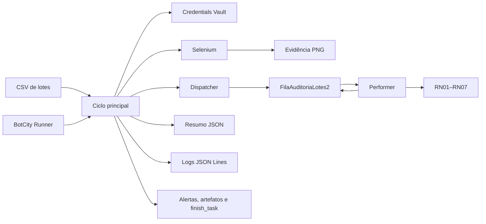

# Conferência de Lotes

Automação corporativa para conferência de registros de inspeção de lotes, com
processamento resiliente por item, rastreabilidade operacional e integração com
BotCity Maestro, DataPool e Credentials Vault.

## Visão geral

O projeto transforma um processo manual de validação de planilhas em um fluxo
automatizado composto por Dispatcher e Performer:

1. o Dispatcher lê um CSV padronizado e publica uma entrada por linha no
   DataPool `FilaAuditoriaLotes2`;
2. o Performer consome os itens, recupera a credencial `credencial_erp2`,
   aplica as regras RN01–RN07 e finaliza cada item individualmente;
3. o ciclo principal consolida o resultado em JSON, publica evidências e
   finaliza a task do Maestro;
4. uma etapa web opcional, implementada com Selenium, valida o formulário local
   e gera uma evidência visual.

Uma inconsistência de negócio afeta apenas o item correspondente. Falhas
técnicas fatais são diferenciadas de rejeições e revisões de negócio.

## Objetivo

Padronizar a conferência de lotes e produzir uma execução:

- resiliente, para que um item inválido não interrompa os demais;
- rastreável, por meio de logs estruturados, relatório e evidências;
- segura, mantendo a senha do ERP exclusivamente no Credentials Vault;
- reproduzível, com modos local, Docker e BotCity Runner;
- testável, isolando integrações externas por protocolos e adaptadores.

## Escopo

Estão implementados:

- configuração por variáveis de ambiente e caminhos relativos ao projeto;
- fail-fast para a pasta `dados_entrada/`;
- leitura do CSV por cabeçalho;
- publicação e consumo de itens no DataPool;
- gateways local e BotCity Maestro;
- validações RN01–RN07;
- normalização de status e separação de casos ambíguos;
- recuperação da credencial do ERP pelo Vault;
- alertas, artefato JSON e finalização da task no Maestro;
- logs estruturados em JSON Lines no arquivo e no console;
- automação web opcional com Selenium e waits explícitos;
- evidência PNG da confirmação apresentada pelo formulário;
- empacotamento ZIP para o BotCity Runner;
- execução em container e integração contínua no GitHub Actions.

## Fora do escopo

Não fazem parte da implementação atual:

- captura automática de anexos de e-mail;
- leitura direta de arquivos XLSX pelo Dispatcher;
- lançamento de dados em um ERP real;
- atualização automática da base de referência de lotes;
- interface para tratamento dos casos encaminhados à revisão humana;
- Selenium Grid ou execução distribuída do navegador;
- gestão de agenda, capacidade e infraestrutura produtiva do Runner.

O formulário web presente em `web/index-lotes/` é um ambiente controlado de
validação e evidência. Ele não representa um ERP produtivo.

## Processo de negócio


O diagrama apresenta as visões AS-IS e TO-BE do processo. A fonte editável está
em [`docs/diagrama_pdd.bpmn`](docs/diagrama_pdd.bpmn), e o registro da revisão
de aderência está em
[`docs/REVISAO_BPMN_PDD.md`](docs/REVISAO_BPMN_PDD.md).

## Arquitetura



Os módulos de domínio não dependem diretamente do SDK do BotCity. Protocolos,
fachadas e adaptadores permitem usar o gateway real no Runner e implementações
em memória nos testes e na execução local.

A descrição dos componentes, limites de responsabilidade e diagramas de
sequência está em [`docs/ARQUITETURA.md`](docs/ARQUITETURA.md).

## Fluxo de execução

1. `bot.py` carrega as configurações e reconhece o contexto local ou Runner.
2. A configuração e a pasta de entrada são validadas antes do processamento.
3. O Maestro recebe o alerta inicial quando a integração real está ativa.
4. A credencial do ERP é recuperada e validada sem registrar a senha.
5. Quando habilitado, o Selenium valida o formulário e gera uma evidência PNG.
6. O Dispatcher publica cada linha do CSV no DataPool.
7. O Performer consome a fila e processa cada item em um `try/except` isolado.
8. Cada item é concluído, rejeitado, marcado como falha técnica ou encaminhado
   para revisão humana.
9. O resumo é persistido em `relatorios/resumo_execucao.json` e publicado como
   artefato.
10. A task é finalizada e o encerramento operacional é registrado.

### Resultados da execução

| Resultado | Significado |
|---|---|
| `SUCCESS` | Todos os itens foram processados sem erro ou revisão. |
| `PARTIALLY_COMPLETED` | O ciclo terminou, mas existem rejeições de negócio ou revisões humanas. |
| `FAILED` | Uma falha fatal impediu a conclusão normal do ciclo. |

No Maestro, uma execução concluída com erros de negócio continua sendo
finalizada como sucesso operacional. O detalhamento permanece nos itens do
DataPool e no resumo da execução.

## Regras de validação

| Regra | Comportamento |
|---|---|
| RN01 | Exige exatamente `lote_id`, `produto`, `linha`, `turno`, `status`, `responsavel`, `data` e `observacao`. |
| RN02 | Exige todos os campos, exceto `observacao`. |
| RN03 | Confirma que `lote_id` pertence à base configurada em `REFERENCE_LOTES`. |
| RN04 | Aceita como estados finais apenas `APROVADO` e `REPROVADO`. |
| RN05 | Normaliza `OK` para `APROVADO` e `NOK` para `REPROVADO`. |
| RN06 | Encaminha `PENDENTE`, `EM ANALISE`, `A REVISAR` e `REVISAO` para revisão humana. |
| RN07 | Exige observação para lotes com status final `REPROVADO`. |

RN01, RN02, RN03, RN04 e RN07 geram erro de negócio. RN06 gera revisão humana.
Exceções inesperadas durante um item são classificadas como erro de sistema.

## Estrutura do projeto

```text
.
├── .github/workflows/ci.yml       # testes e build da imagem em CI
├── artefatos/                     # evidências PNG geradas
├── dados_entrada/
│   └── lotes_auditoria.csv        # massa de entrada de exemplo
├── docs/
│   ├── ARQUITETURA.md             # componentes e sequências técnicas
│   ├── DEPLOY_BOTCITY.md          # implantação e operação no Runner
│   ├── GUIA_COLABORACAO_GIT.md    # processo de colaboração da equipe
│   ├── REVISAO_BPMN_PDD.md        # aderência entre processo e código
│   ├── diagrama_pdd.bpmn          # fonte editável do processo
│   └── diagrama_pdd.svg           # visualização do BPMN
├── web/
│   └── index-lotes/
│       ├── login.html              # autenticação web controlada
│       └── index.html              # formulário de lotes
├── logs/                          # logs JSON Lines
├── relatorios/                    # resumos JSON
├── scripts/
│   └── build_botcity_package.py   # geração do pacote BotCity
├── src/
│   ├── bot.py                     # Performer
│   ├── config.py                  # configuração e contexto do Runner
│   ├── dispatcher.py              # CSV para DataPool
│   ├── logging_config.py          # log estruturado e sanitização
│   ├── maestro_client.py          # gateways local e BotCity
│   ├── main.py                    # orquestração do ciclo
│   ├── models.py                  # ExecutionResult
│   ├── pages/
│   │   └── login_page.py          # Page Object da autenticação web
│   ├── validation.py              # RN01–RN07
│   ├── vault_client.py            # Credentials Vault
│   └── web_automation.py          # Selenium e evidências
├── tests/                         # suíte automatizada
├── .env.example                   # configuração segura de referência
├── bot.py                         # entry point
├── Dockerfile
├── docker-compose.yml
├── requirements.txt
└── requirements-dev.txt
```

Arquivos gerados em `logs/`, `relatorios/`, `artefatos/` e `dist/` não são
versionados.

## Pré-requisitos

### Execução local

- Python 3.10 ou superior;
- Google Chrome ou Chromium apenas quando o Selenium estiver habilitado;
- Git para obter e versionar o projeto.

### Integração real

- workspace e Runner ativos no BotCity Maestro;
- DataPool `FilaAuditoriaLotes2`;
- credencial `credencial_erp2`;
- Chrome/Chromium e ChromeDriver compatíveis no host do Runner;
- permissões para publicar artefatos e finalizar tasks.

## Configuração do ambiente

Clone o repositório:

```bash
git clone https://github.com/g-f307/conferencia-de-lotes.git
cd conferencia-de-lotes
```

Crie e ative o ambiente virtual no Linux:

```bash
python -m venv .venv
source .venv/bin/activate
```

No Windows PowerShell:

```powershell
python -m venv .venv
.venv\Scripts\Activate.ps1
```

Instale as dependências e crie o `.env` local:

```bash
python -m pip install -r requirements-dev.txt
cp .env.example .env
```

No PowerShell, substitua o último comando por:

```powershell
Copy-Item .env.example .env
```

### Variáveis de ambiente

| Variável | Finalidade | Padrão ou exemplo seguro |
|---|---|---|
| `MAESTRO_ENABLED` | Seleciona o gateway real do Maestro. | `false` |
| `VAULT_ENABLED` | Exige o Credentials Vault quando o Maestro está ativo. | `false` |
| `MAESTRO_SERVER` | URL do workspace. | vazio |
| `MAESTRO_LOGIN` | Login técnico usado fora do Runner. | vazio |
| `MAESTRO_KEY` | Chave técnica usada fora do Runner. | vazio |
| `MAESTRO_TASK_ID` | Task de teste fora do Runner; no Runner vem dos argumentos. | vazio |
| `BOT_ID` | Identificador do bot nos logs e na operação. | `bot-conferencia-de-lotes-v2` |
| `EXECUTION_ID` | Correlação dos logs; no Runner usa o `task_id`. | `execucao-local` |
| `DATAPOOL_LABEL` | DataPool usado pelo Dispatcher e Performer. | `FilaAuditoriaLotes2` |
| `VAULT_LABEL` | Label da credencial do ERP. | `credencial_erp2` |
| `REFERENCE_LOTES` | IDs válidos separados por vírgula. | `L001,L002` |
| `INPUT_DIR` | Pasta validada no fail-fast. | `dados_entrada` |
| `INPUT_CSV` | CSV publicado pelo Dispatcher. | `dados_entrada/lotes_auditoria.csv` |
| `LOG_FILE` | Destino do log estruturado. | `logs/execucao.log` |
| `REPORT_DIR` | Destino do resumo JSON. | `relatorios` |
| `PROCESSING_DELAY_SECONDS` | Atraso simulado entre itens. | `1` |
| `WEB_AUTOMATION_ENABLED` | Ativa Selenium; no Runner é `true` quando ausente. | `false` local |
| `WEB_TEST_URL` | URL ou caminho da página controlada. | `web/index-lotes/index.html` |
| `WEB_ARTIFACT_DIR` | Destino das evidências PNG. | `artefatos` |
| `WEB_TIMEOUT_SECONDS` | Limite dos waits explícitos. | `15` |
| `CHROME_BIN` | Caminho explícito do Chrome/Chromium. | vazio |
| `CHROMEDRIVER_PATH` | Caminho explícito do ChromeDriver. | vazio |

Variáveis de caminho relativas são resolvidas a partir da raiz do projeto.
Variáveis definidas pelo ambiente têm precedência sobre o arquivo `.env`.

### Classificação das configurações

- **Não sigilosas:** flags, labels, IDs de correlação, listas de referência,
  caminhos e timeouts podem ser configurados no ambiente operacional.
- **Acesso técnico:** `MAESTRO_LOGIN` e `MAESTRO_KEY` não devem receber valores
  reais no repositório, na imagem ou no pacote. No Runner, o contexto é
  fornecido pelos argumentos da task.
- **Credencial de negócio:** a senha do ERP não é uma variável deste projeto e
  deve existir somente no Credentials Vault.
- **Token do Runner:** o terceiro argumento recebido por `bot.py` é administrado
  pelo BotCity e nunca deve ser registrado.

## Credentials Vault

O Credentials Vault deve possuir o label:

```text
credencial_erp2
```

Chaves obrigatórias:

```text
username
password
```

A senha do ERP pertence exclusivamente ao Vault. Ela não pode ser adicionada ao
`.env`, ao código, ao pacote, aos logs ou aos relatórios. Em execução local, o
projeto utiliza uma credencial efêmera apenas para preservar o mesmo contrato.

## DataPool

O DataPool `FilaAuditoriaLotes2` deve conter campos de texto com os mesmos nomes
do CSV:

```text
lote_id
produto
linha
turno
status
responsavel
data
observacao
```

O Dispatcher exige exatamente esse cabeçalho. O Performer associa o item à task
do Runner e registra seu resultado individual no Maestro.

## Execução local

Com Maestro, Vault e Selenium desabilitados:

```bash
MAESTRO_ENABLED=false \
VAULT_ENABLED=false \
WEB_AUTOMATION_ENABLED=false \
PROCESSING_DELAY_SECONDS=0 \
python bot.py
```

No PowerShell:

```powershell
$env:MAESTRO_ENABLED="false"
$env:VAULT_ENABLED="false"
$env:WEB_AUTOMATION_ENABLED="false"
$env:PROCESSING_DELAY_SECONDS="0"
python bot.py
```

A execução usa o gateway em memória, processa o CSV e gera:

- `logs/execucao.log`;
- `relatorios/resumo_execucao.json`.

## Execução com Docker

Construa a imagem:

```bash
docker build -t conferencia-de-lotes:local .
```

Execute o fluxo local:

```bash
mkdir -p logs relatorios artefatos
docker compose up --build --abort-on-container-exit
```

Execute uma rodada pontual com Selenium:

```bash
WEB_AUTOMATION_ENABLED=true docker compose run --rm conferencia-de-lotes
```

O Compose monta `dados_entrada/` como somente leitura e persiste logs,
relatórios e evidências no host. A imagem contém Chromium e ChromeDriver, sem
download de driver durante a execução.

## Execução no BotCity Runner

O Runner chama o entry point no formato:

```text
bot.py <maestro-server> <task-id> <token>
```

Nesse contexto:

- Maestro e Vault ficam ativos por padrão;
- `task-id` identifica a execução e alimenta `EXECUTION_ID`;
- Selenium fica ativo por padrão quando `WEB_AUTOMATION_ENABLED` não é definido;
- `CHROME_BIN` e `CHROMEDRIVER_PATH` podem indicar os binários homologados;
- a task é finalizada explicitamente por `finish_task`.

O pacote homologado é gerado com:

```bash
python scripts/build_botcity_package.py --version 2
```

Artefato:

```text
dist/bot-conferencia-de-lotes-v2.zip
```

O procedimento completo, incluindo smoke test e rollback, está em
[`docs/DEPLOY_BOTCITY.md`](docs/DEPLOY_BOTCITY.md).

## Automação web e evidências

O Selenium:

- inicia Chrome/Chromium em modo headless;
- preenche o número do lote com `send_keys`;
- seleciona produto e status;
- aguarda o botão com `element_to_be_clickable`;
- aguarda a confirmação com `visibility_of_element_located`;
- valida o texto de sucesso;
- captura a confirmação em PNG;
- sempre encerra o navegador em `finally`.

Em distribuições Debian/Ubuntu, Chromium e ChromeDriver podem ser instalados
para desenvolvimento com:

```bash
sudo apt-get update
sudo apt-get install chromium chromium-driver
```

O projeto não utiliza mais Playwright; portanto, não existe etapa
`playwright install chromium`.

Para executar localmente:

```bash
MAESTRO_ENABLED=false \
VAULT_ENABLED=false \
WEB_AUTOMATION_ENABLED=true \
PROCESSING_DELAY_SECONDS=0 \
python bot.py
```

Se `CHROMEDRIVER_PATH` estiver vazio, o `webdriver-manager` pode obter um driver
compatível no ambiente local. No Runner, utilize o driver homologado em
`/usr/local/bin/chromedriver` para não depender de download.

## Logs, relatórios e artefatos

### Logs

Cada linha de `logs/execucao.log` é um objeto JSON independente. Esse formato,
conhecido como JSON Lines, facilita correlação, busca e ingestão por ferramentas
de observabilidade.

Campos principais:

| Campo | Conteúdo |
|---|---|
| `timestamp` | Data e hora UTC em ISO 8601. |
| `level` | Severidade (`INFO`, `WARNING` ou `ERROR`). |
| `execution_id` | Identificador da execução. |
| `bot_id` | Identificador da automação. |
| `evento` | Código do evento operacional. |
| `aplicacao` | Nome lógico da aplicação. |
| `ambiente` | `local` ou `runner`. |
| `usuario` | Usuário operacional, nunca a senha. |
| `detalhes` | Formulário, status, mensagem e eventual exceção sanitizada. |

Exemplo:

```json
{"timestamp":"2026-07-27T23:00:00+00:00","level":"INFO","execution_id":"execucao-local","bot_id":"bot-conferencia-de-lotes-v2","evento":"FIM_PROCESSAMENTO","aplicacao":"bot-conferencia-de-lotes-v2","ambiente":"local","usuario":"sistema","detalhes":{"formulario":"Resumo","status":"PARTIALLY_COMPLETED","mensagem":"Execucao finalizada"}}
```

O formatador mascara atribuições e valores associados a senha, token, chave e
API key antes da persistência.

### Relatório

`relatorios/resumo_execucao.json` contém:

- status e mensagem;
- totais processados, rejeitados e ambíguos;
- horários de início e término;
- erros consolidados, quando existentes.

### Artefatos

- `resumo_execucao.json`: publicado no Maestro;
- `comprovante-<lote>-<timestamp>.png`: evidência da automação web.

## Testes e integração contínua

Execute a suíte:

```bash
python -m pytest -q
```

Execute com cobertura mínima:

```bash
python -m pytest \
  --cov=src \
  --cov-report=term-missing \
  --cov-fail-under=80
```

A documentação não fixa a quantidade de testes, pois ela evolui com o projeto.
O critério é a conclusão integral da suíte e a cobertura mínima definida.

O workflow [`.github/workflows/ci.yml`](.github/workflows/ci.yml) é acionado em
pushes para `main` e em Pull Requests destinados a `main`. Ele:

1. instala as dependências de desenvolvimento;
2. executa a suíte com `pytest`;
3. constrói a imagem Docker em um job independente.

A CI não utiliza credenciais reais do Maestro ou do Vault.

## Tratamento de erros

| Categoria | Exemplo | Comportamento |
|---|---|---|
| Configuração | variável obrigatória ausente | Falha controlada antes do processamento. |
| Entrada | pasta `dados_entrada/` ausente | Fail-fast e alerta de erro no Maestro. |
| Negócio | RN01, RN02, RN03, RN04 ou RN07 | Item marcado com erro e fila continua. |
| Revisão humana | RN06 | Item separado para análise sem criar estado final “pendente”. |
| Sistema por item | exceção inesperada no Performer | Item marcado como erro técnico e fila continua. |
| Sistema fatal | falha de Vault, Selenium, Dispatcher ou Maestro | Execução `FAILED`, log estruturado e tentativa de finalizar a task. |

## Segurança

- nenhum segredo é versionado;
- a senha do ERP fica somente no Credentials Vault;
- `.env`, logs, relatórios, evidências e pacotes gerados são ignorados pelo Git;
- o pacote BotCity exclui arquivos locais e caches;
- logs sanitizam valores sensíveis;
- imagens Docker não recebem credenciais no build;
- a `main` exige Pull Request e revisão;
- force push e exclusão da branch principal são bloqueados por ruleset.

## Documentação complementar

| Documento | Finalidade |
|---|---|
| [`docs/ARQUITETURA.md`](docs/ARQUITETURA.md) | Componentes, sequências, limites e manutenção. |
| [`docs/DEPLOY_BOTCITY.md`](docs/DEPLOY_BOTCITY.md) | Build, implantação, smoke test e rollback. |
| [`docs/REVISAO_BPMN_PDD.md`](docs/REVISAO_BPMN_PDD.md) | Rastreabilidade do processo e das regras. |
| [`docs/GUIA_COLABORACAO_GIT.md`](docs/GUIA_COLABORACAO_GIT.md) | GitHub Flow utilizado pela equipe. |
| [`docs/diagrama_pdd.bpmn`](docs/diagrama_pdd.bpmn) | Fonte BPMN editável. |
| [`docs/diagrama_pdd.svg`](docs/diagrama_pdd.svg) | Visualização do processo. |
| [`docs/Regras de validação a aplicar - Gabriel, Marcelo e Rebecca.docx.pdf`](docs/Regras%20de%20validação%20a%20aplicar%20-%20Gabriel,%20Marcelo%20e%20Rebecca.docx.pdf) | Documento-base das regras. |
| [`docs/Inspeção de Lotes - Gabriel, Marcelo e Rebecca.xlsx`](docs/Inspeção%20de%20Lotes%20-%20Gabriel,%20Marcelo%20e%20Rebecca.xlsx) | Massa de referência do levantamento. |

## Equipe e colaboração

| Integrante | Responsabilidade inicial |
|---|---|
| Gabriel Fernandes | Configuração, logs, fail-fast e resultado de execução. |
| Marcelo Uchôa | Dispatcher, DataPool, Maestro, empacotamento e deploy. |
| Rebecca Xavier | Regras RN01–RN07, Performer e Credentials Vault. |

O projeto utiliza GitHub Flow:

1. Issue com escopo e critérios de aceite;
2. branch criada a partir da `main` atualizada;
3. commits claros e descritivos, divididos por blocos lógicos;
4. Pull Request vinculado à Issue;
5. testes e revisão por outro integrante;
6. squash merge e exclusão da branch remota;
7. atualização e limpeza das branches locais.

Commits não devem ser vagos ou artificiosamente pequenos. Uma funcionalidade
ampla também não deve ser concentrada em um único commit quando possui blocos
independentes de implementação, testes, build e documentação.

## Releases

| Release GitHub | Marco |
|---|---|
| `v1.0.0` | Primeira versão implantável no BotCity Maestro. |
| `v1.1.0` | Consolidação do fluxo completo da automação. |
| `v1.2.0` | Release prevista para Selenium, homologação no Runner e documentação final. |

Na entrega `v1.2.0`, o ambiente BotCity utiliza:

```text
Bot ID: bot-conferencia-de-lotes-v2
Versão no Maestro: 2
Pacote: bot-conferencia-de-lotes-v2.zip
```

O versionamento do GitHub registra a evolução funcional do projeto; a
identificação `v2` registra a implantação homologada no BotCity.

## Licença

Este repositório não possui licença de uso definida. O código e os materiais
devem ser utilizados conforme as orientações da atividade acadêmica e da equipe.
