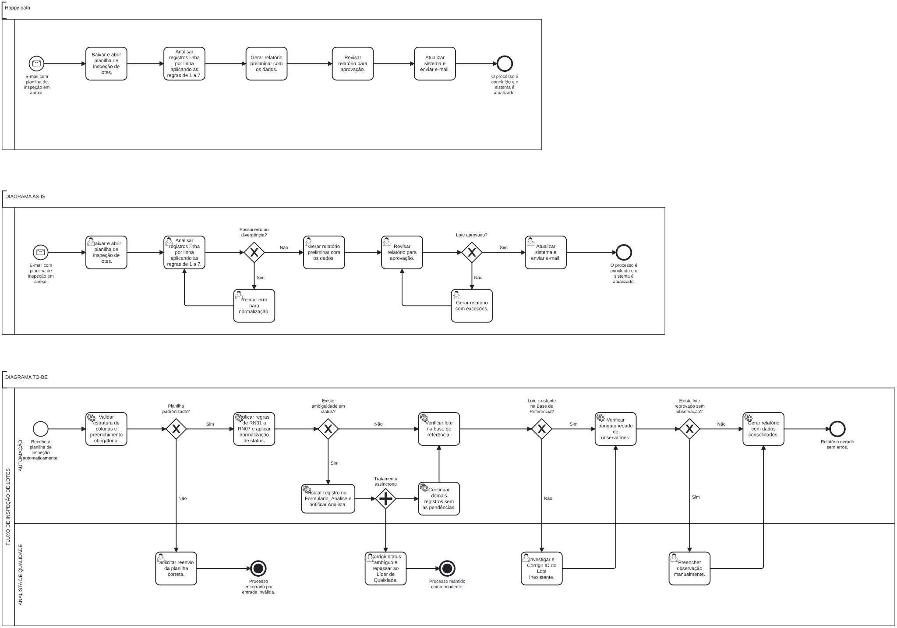
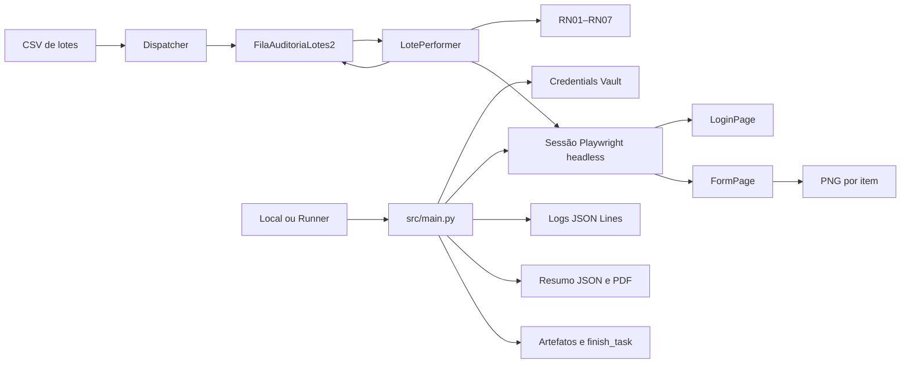

# Conferência de Lotes

Automação corporativa para conferência de registros de inspeção, com
processamento resiliente por item, integração com BotCity Maestro e automação
web controlada por Playwright.

## Visão geral

O fluxo combina Dispatcher, DataPool, Performer, Credentials Vault, Page
Objects, evidências visuais e observabilidade:

1. o Dispatcher lê `dados_entrada/lotes_auditoria.csv` e publica uma entrada
   por linha no DataPool `FilaAuditoriaLotes2`;
2. a credencial `credencial_erp2` é recuperada do Credentials Vault;
3. uma sessão Playwright headless autentica uma única vez na aplicação local;
4. o Performer consome a fila e processa cada lote isoladamente;
5. as regras RN01–RN07 determinam aprovação, divergência ou revisão;
6. `LoginPage` e `FormPage` executam a interação web correspondente ao item;
7. o resultado, a mensagem e o caminho da captura são gravados no DataPool
   antes da finalização do item;
8. logs JSON Lines, resumo JSON e relatório PDF consolidam a execução.

Uma inconsistência ou falha web em um lote não interrompe os demais itens. Uma
falha anterior ao consumo, como configuração, entrada ou credencial inválida,
encerra a execução imediatamente.

## Objetivo

Executar a conferência de lotes de forma:

- resiliente, isolando falhas por item;
- rastreável, com resultado e evidência associados ao lote;
- segura, sem credenciais no código, no `.env` ou nos logs;
- reproduzível nos modos local, Docker e BotCity Runner;
- manutenível, separando regras, orquestração e interface por Page Objects;
- auditável, com logs estruturados e resultados consolidados.

## Escopo

Estão implementados:

- configuração externa e caminhos relativos;
- fail-fast da pasta `dados_entrada/`;
- Dispatcher de CSV por cabeçalho;
- DataPool local ou BotCity Maestro;
- validações RN01–RN07;
- recuperação da credencial pelo Vault;
- Playwright síncrono com Chromium headless;
- Page Objects com locators semânticos e waits por condição;
- processamento web e captura de PNG por item;
- continuidade após divergência, revisão ou falha técnica isolada;
- campos de saída no DataPool;
- logs estruturados no arquivo e no console;
- resumo JSON, relatório PDF, artefatos e `finish_task`;
- pacote ZIP para o BotCity Runner;
- Docker e integração contínua.

## Fora do escopo

Não fazem parte desta versão:

- captura de anexos de e-mail;
- leitura direta de XLSX;
- acesso ou atualização de ERP produtivo;
- armazenamento de credenciais reais no repositório;
- interface para resolução dos itens encaminhados à revisão;
- execução distribuída de navegadores;
- alteração automática da base de referência.

`web/index-lotes/` é uma aplicação controlada, destinada somente à
demonstração e à produção de evidências. Nenhum sistema real é acessado.

## Processo de negócio



O modelo editável está em
[`docs/diagrama_pdd.bpmn`](docs/diagrama_pdd.bpmn). A relação entre o processo,
as regras e o código está registrada em
[`docs/REVISAO_BPMN_PDD.md`](docs/REVISAO_BPMN_PDD.md).

## Arquitetura



As responsabilidades principais são:

| Componente | Responsabilidade |
|---|---|
| `src/main.py` | Validar o ambiente e coordenar Vault, Playwright, Dispatcher, Performer e encerramento. |
| `src/dispatcher.py` | Publicar uma entrada por linha e reservar os campos de saída. |
| `src/bot.py` | Classificar, processar e finalizar cada item de forma isolada. |
| `src/validation.py` | Aplicar RN01–RN07 sem dependência da interface. |
| `src/web_automation.py` | Gerenciar o ciclo da sessão Playwright e a evidência por item. |
| `src/pages/login_page.py` | Encapsular autenticação, locators e waits. |
| `src/pages/form_page.py` | Encapsular o formulário, a confirmação e a captura visual. |
| `src/maestro_client.py` | Adaptar DataPool, alertas, artefatos e task. |
| `src/vault_client.py` | Recuperar e validar a credencial somente em memória. |

Detalhes e diagramas de sequência estão em
[`docs/ARQUITETURA.md`](docs/ARQUITETURA.md).

## Fluxo de execução

1. `bot.py` carrega o ambiente e os argumentos opcionais do Runner.
2. `Settings.validate()` valida configuração, caminhos e timeout.
3. A ausência de `dados_entrada/` causa falha imediata e alerta no Maestro.
4. O Vault é validado antes da criação ou do consumo de itens.
5. Quando habilitada, a sessão Playwright inicia em modo headless e
   `LoginPage.fazer_login()` utiliza a credencial recuperada.
6. O Dispatcher publica o CSV no DataPool.
7. O Performer obtém um item e aplica RN01–RN07.
8. `FormPage.preencher_lote()` apresenta o resultado do item na aplicação
   controlada e aguarda a confirmação.
9. Uma captura `aprovado-*`, `divergencia-*` ou `erro-*` é produzida.
10. `resultado_validacao`, `evidencia` e `mensagem_resultado` são atualizados no
    DataPool antes de `report_done` ou `report_error`.
11. O loop continua até o fim da fila.
12. O resumo e o PDF são publicados, e a task é finalizada.
13. Página, navegador e runtime Playwright são encerrados em `finally`.

Não existem `sleep()` para sincronização da interface. A camada web aguarda
condições explícitas de visibilidade, disponibilidade e confirmação.

## Regras de validação

| Regra | Comportamento |
|---|---|
| RN01 | Reconhece somente os campos oficiais do lote e os três campos operacionais de saída. |
| RN02 | Exige todos os campos de entrada, exceto `observacao`. |
| RN03 | Confirma que `lote_id` pertence a `REFERENCE_LOTES`. |
| RN04 | Aceita como estados finais apenas `APROVADO` e `REPROVADO`. |
| RN05 | Normaliza `OK` para `APROVADO` e `NOK` para `REPROVADO`. |
| RN06 | Encaminha estados ambíguos para revisão humana. |
| RN07 | Exige observação quando o lote está reprovado. |

As regras permanecem em `src/validation.py`. Os Page Objects apenas representam
a interface e não decidem o resultado do negócio.

## Resultados por item

| `resultado_validacao` | Finalização | Evidência |
|---|---|---|
| `APROVADO` | `report_done` | `artefatos/aprovado-<lote>-<timestamp>.png` |
| `DIVERGENCIA` | erro de negócio | `artefatos/divergencia-<lote>-<timestamp>.png` |
| `REVISAO` | erro de negócio com motivo de revisão | `artefatos/divergencia-<lote>-<timestamp>.png` |
| `ERRO` | erro de sistema | `artefatos/erro-<lote>-<timestamp>.png`, quando a captura for possível |

O caminho gravado no DataPool, no log e no resumo é relativo à raiz do projeto,
o que evita referências específicas de uma máquina ou Runner.

## Estrutura do projeto

```text
.
├── .github/workflows/ci.yml
├── artefatos/                     # PNG gerado em runtime
├── dados_entrada/
│   └── lotes_auditoria.csv
├── docs/
│   ├── ADERENCIA_PAGE_OBJECTS.md
│   ├── ARQUITETURA.md
│   ├── DEPLOY_BOTCITY.md
│   ├── REVISAO_BPMN_PDD.md
│   ├── ROTEIRO_DEMONSTRACAO.md
│   ├── diagrama_pdd.bpmn
│   └── diagrama_pdd.svg
├── logs/                          # JSON Lines gerado em runtime
├── relatorios/                    # JSON e PDF gerados em runtime
├── scripts/
│   └── build_botcity_package.py
├── src/
│   ├── pages/
│   │   ├── login_page.py
│   │   └── form_page.py
│   ├── bot.py
│   ├── config.py
│   ├── dispatcher.py
│   ├── logging_config.py
│   ├── maestro_client.py
│   ├── main.py
│   ├── models.py
│   ├── reporting.py
│   ├── validation.py
│   ├── vault_client.py
│   └── web_automation.py
├── tests/
├── web/index-lotes/               # aplicação controlada
├── .env.example
├── bot.py
├── Dockerfile
├── docker-compose.yml
├── requirements.txt
└── requirements-dev.txt
```

`.env`, logs, relatórios, PNG, pacotes e caches não são versionados. Os
diretórios operacionais mantêm somente seus arquivos `.gitkeep`.

## Pré-requisitos

- Python 3.10 ou superior;
- Git;
- Chromium fornecido pelo Playwright ou instalado no ambiente;
- para integração real, workspace e Runner ativos no BotCity Maestro.

O ambiente do Maestro deve possuir:

- DataPool `FilaAuditoriaLotes2`;
- credencial `credencial_erp2`;
- permissão para alertas, artefatos e finalização de tasks.

## Instalação

```bash
git clone https://github.com/g-f307/conferencia-de-lotes.git
cd conferencia-de-lotes
python -m venv .venv
source .venv/bin/activate
python -m pip install -r requirements-dev.txt
python -m playwright install chromium
cp .env.example .env
```

No PowerShell:

```powershell
python -m venv .venv
.venv\Scripts\Activate.ps1
python -m pip install -r requirements-dev.txt
python -m playwright install chromium
Copy-Item .env.example .env
```

O comando `playwright install chromium` é necessário somente quando não houver
um Chromium compatível configurado em `PLAYWRIGHT_CHROMIUM_PATH`.

## Variáveis de ambiente

| Variável | Finalidade | Padrão |
|---|---|---|
| `MAESTRO_ENABLED` | Ativa o gateway BotCity. | `false` |
| `VAULT_ENABLED` | Exige o Credentials Vault. | `false` |
| `MAESTRO_SERVER` | URL do workspace fora do Runner. | vazio |
| `MAESTRO_LOGIN` | Login técnico fora do Runner. | vazio |
| `MAESTRO_KEY` | Chave técnica fora do Runner. | vazio |
| `MAESTRO_TASK_ID` | Task controlada fora do Runner. | vazio |
| `BOT_ID` | Identificador da automação. | `bot-conferencia-de-lotes-v2` |
| `EXECUTION_ID` | Correlação dos logs. | `execucao-local` |
| `DATAPOOL_LABEL` | Nome da fila. | `FilaAuditoriaLotes2` |
| `VAULT_LABEL` | Nome da credencial. | `credencial_erp2` |
| `REFERENCE_LOTES` | IDs de referência separados por vírgula. | `L001,L002` |
| `INPUT_DIR` | Diretório validado no fail-fast. | `dados_entrada` |
| `INPUT_CSV` | Massa publicada pelo Dispatcher. | `dados_entrada/lotes_auditoria.csv` |
| `LOG_FILE` | Log JSON Lines. | `logs/execucao.log` |
| `REPORT_DIR` | Resumo e PDF. | `relatorios` |
| `PROCESSING_DELAY_SECONDS` | Atraso de demonstração após aprovação. | `0` |
| `WEB_AUTOMATION_ENABLED` | Ativa a sessão Playwright. | `false` local |
| `WEB_TEST_URL` | Aplicação controlada. | `web/index-lotes/index.html` |
| `WEB_ARTIFACT_DIR` | Capturas por item. | `artefatos` |
| `WEB_TIMEOUT_SECONDS` | Timeout dos waits por condição. | `15` |
| `PLAYWRIGHT_CHROMIUM_PATH` | Chromium explícito do Runner. | vazio |

Caminhos relativos são resolvidos a partir da raiz do projeto. A senha do ERP
não é uma variável de ambiente deste projeto.

## Credentials Vault

Crie o label `credencial_erp2` com as chaves:

```text
username
password
```

A ausência da credencial, do usuário ou da senha interrompe o fluxo antes da
publicação e do processamento dos itens. Somente o nome do usuário pode aparecer
no log.

## DataPool

Crie `FilaAuditoriaLotes2` com os onze campos de texto:

```text
lote_id
produto
linha
turno
status
responsavel
data
observacao
resultado_validacao
evidencia
mensagem_resultado
```

Os oito primeiros são entradas. Os três últimos são inicializados vazios pelo
Dispatcher e preenchidos pelo Performer antes da finalização individual.

## Execução local

Sem navegador:

```bash
MAESTRO_ENABLED=false \
VAULT_ENABLED=false \
WEB_AUTOMATION_ENABLED=false \
PROCESSING_DELAY_SECONDS=0 \
python bot.py
```

Com Playwright e evidências por item:

```bash
MAESTRO_ENABLED=false \
VAULT_ENABLED=false \
WEB_AUTOMATION_ENABLED=true \
PROCESSING_DELAY_SECONDS=0 \
python bot.py
```

A execução local usa gateway em memória e credencial efêmera. Ao final,
verifique:

```text
logs/execucao.log
relatorios/resumo_execucao.json
relatorios/relatorio_evidencias.pdf
artefatos/*.png
```

## Docker

```bash
mkdir -p logs relatorios artefatos
docker compose up --build --abort-on-container-exit
```

Para habilitar o navegador:

```bash
WEB_AUTOMATION_ENABLED=true docker compose run --rm conferencia-de-lotes
```

A imagem instala Chromium e define
`PLAYWRIGHT_CHROMIUM_PATH=/usr/bin/chromium`. Os diretórios de saída são
montados no host.

## BotCity Runner

O Runner invoca:

```text
bot.py <maestro-server> <task-id> <token>
```

Nesse contexto, Maestro, Vault e automação web ficam ativos por padrão, salvo
configuração explícita de contingência. O token recebido não é registrado.

Gere o pacote:

```bash
python scripts/build_botcity_package.py --version 2
unzip -l dist/bot-conferencia-de-lotes-v2.zip
```

O ZIP contém somente o necessário para execução:

```text
bot.py
requirements.txt
src/
dados_entrada/
web/index-lotes/
```

O procedimento completo está em
[`docs/DEPLOY_BOTCITY.md`](docs/DEPLOY_BOTCITY.md).

## Logs, resumo e evidências

Cada linha de `logs/execucao.log` é um objeto JSON independente, com
`timestamp`, `level`, `execution_id`, `bot_id`, `evento`, `ambiente`, `usuario`
e `detalhes`.

Eventos relevantes:

| Evento | Finalidade |
|---|---|
| `VALIDACAO_VAULT` | Confirma a disponibilidade da credencial. |
| `PLAYWRIGHT_AMBIENTE` | Registra engine, caminho e versão do navegador. |
| `INICIO_PLAYWRIGHT` / `FIM_PLAYWRIGHT` | Delimitam a sessão web. |
| `INICIO_ITEM` / `RESULTADO_ITEM` | Delimitam o processamento do lote. |
| `EVIDENCIA_ITEM` | Relaciona a captura ao item. |
| `ERRO_WEB_ITEM` | Registra falha isolada da interação web. |
| `PUBLICACAO_RESULTADOS` | Confirma JSON e PDF. |
| `ENCERRAMENTO` | Confirma sucesso operacional. |

`resumo_execucao.json` inclui total, aprovados, divergências, revisões,
erros técnicos e a lista de caminhos das evidências. O PDF e o JSON são
publicados como artefatos da task.

## Testes e integração contínua

```bash
python -m pytest -q
python -m pytest --cov=src --cov-report=term-missing --cov-fail-under=80
```

O workflow `.github/workflows/ci.yml` executa a suíte, constrói a imagem Docker
e roda um smoke test Playwright headless com massa e credencial efêmera
controladas. Ele é acionado em Pull Requests e em alterações da `main`, sem
utilizar credenciais reais.

## Tratamento de erros

| Categoria | Comportamento |
|---|---|
| Configuração ou entrada | Falha antes da fila. |
| Vault ou login inicial | Falha antes da publicação dos itens. |
| Divergência RN01–RN07 | Item finalizado como erro de negócio; fila continua. |
| Revisão humana | Item separado com motivo; fila continua. |
| Timeout ou falha web de um item | Captura de erro, saída `ERRO` e fila continua. |
| Falha ao obter o próximo item | Falha fatal, pois não há item seguro para atualizar. |

Uma execução com divergências pode resultar em `PARTIALLY_COMPLETED` e ainda ser
finalizada no Maestro como sucesso operacional.

## Segurança

- `.env` real nunca é versionado ou empacotado;
- a senha existe somente no Vault ou na credencial efêmera local;
- logs sanitizam senha, token, chave e API key;
- capturas usam somente a aplicação e a massa controladas;
- imagens e pacotes não recebem credenciais durante o build;
- logs, relatórios, PNG e `dist/` permanecem fora do Git.

## Documentação complementar

| Documento | Finalidade |
|---|---|
| [`docs/ARQUITETURA.md`](docs/ARQUITETURA.md) | Componentes, sequência e limites. |
| [`docs/REVISAO_BPMN_PDD.md`](docs/REVISAO_BPMN_PDD.md) | Aderência do processo e das regras. |
| [`docs/ADERENCIA_PAGE_OBJECTS.md`](docs/ADERENCIA_PAGE_OBJECTS.md) | Matriz técnica da entrega. |
| [`docs/DEPLOY_BOTCITY.md`](docs/DEPLOY_BOTCITY.md) | Implantação, smoke test e rollback. |
| [`docs/ROTEIRO_DEMONSTRACAO.md`](docs/ROTEIRO_DEMONSTRACAO.md) | Roteiro objetivo da demonstração. |
| [`docs/EVOLUCAO_AUTOMACAO_WEB.md`](docs/EVOLUCAO_AUTOMACAO_WEB.md) | Histórico e comparação entre Selenium e Playwright. |
| [`docs/RELEASE_V1.3.0.md`](docs/RELEASE_V1.3.0.md) | Notas da versão Selenium com Page Objects. |
| [`docs/RELEASE_V1.4.0.md`](docs/RELEASE_V1.4.0.md) | Notas e checklist da candidata Playwright. |

## Equipe

Projeto acadêmico desenvolvido por Gabriel Fernandes, Marcelo Uchôa e Rebecca
Xavier.

## Releases

| Release | Tecnologia | Marco |
|---|---|---|
| `v1.0.0` | Sem integração web final | Primeira versão implantável no BotCity Maestro. |
| `v1.1.0` | Playwright inicial | Consolidação do fluxo corporativo. |
| `v1.2.0` | Selenium | Automação homologada no Runner. |
| [`v1.3.0`](docs/RELEASE_V1.3.0.md) | Selenium com Page Objects | Separação da interface e do orquestrador. |
| [`v1.4.0`](docs/RELEASE_V1.4.0.md) | Playwright com Page Objects | DataPool e evidências rastreáveis por item. |

## Licença

Este repositório não possui licença de uso definida. O código e os materiais
devem ser utilizados conforme as orientações da atividade acadêmica.
