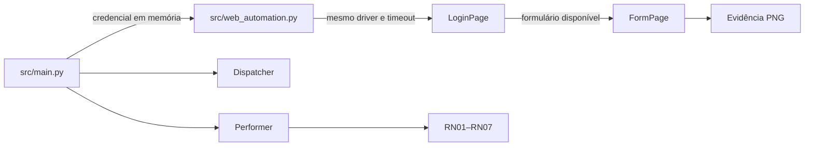

# Aderência da refatoração Page Object

## Finalidade

Este documento relaciona os requisitos da atividade de Page Objects com a
implementação presente no projeto, seus testes e as evidências operacionais.

Os estados usados na matriz são:

- **Atendido:** existe implementação e evidência verificável;
- **Parcial:** a finalidade foi coberta, mas existe diferença nominal ou
  evidência operacional pendente;
- **Não atendido:** o componente solicitado não existe na versão atual;
- **Pendente:** depende de uma ação posterior, como revisão do Pull Request.

## Matriz de rastreabilidade

| Requisito | Implementação | Evidência | Situação |
|---|---|---|---|
| Pasta `src/pages/` | `src/pages/` | `src/pages/__init__.py` e estrutura versionada | Atendido |
| Classe `LoginPage` | `src/pages/login_page.py` | `tests/test_login_page.py` | Atendido |
| Campos de usuário, senha e botão | Constantes de `LoginPage` | Testes dos locators | Atendido |
| Método de autenticação | `LoginPage.fazer_login(usuario, senha)` | Testes de sucesso, validação e timeout | Atendido |
| Classe `FormPage` | `src/pages/form_page.py` | `tests/test_form_page.py` | Atendido |
| Locators do formulário | Constantes de `FormPage` | Testes de número, produto, status, botão e mensagem | Atendido |
| Preenchimento por dicionário | `FormPage.preencher_lote(dados_lote)` | Testes de preenchimento e campos obrigatórios | Atendido |
| Validação da mensagem final | `FormPage.is_sucesso()` | Testes de sucesso, mensagem inválida e timeout | Atendido |
| Evidência visual | `FormPage.capturar_evidencia()` | Teste unitário, execução local e Docker | Atendido |
| Locators centralizados | `LoginPage` e `FormPage` | Ausência de locators em `src/main.py` | Atendido |
| Regras fora dos Page Objects | `src/validation.py` | Testes RN01–RN07 | Atendido |
| Orquestrador sem comandos de navegador | `src/main.py` | Delega a etapa para `run_web_automation()` | Atendido |
| Orquestração dos Page Objects | `src/web_automation.py` | `tests/test_web_automation.py` | Atendido |
| Mesmo driver e timeout | Instanciação em `fill_and_submit_lote()` | Teste de integração dos Page Objects | Atendido |
| Credencial do Vault no login | `src/main.py` e `src/web_automation.py` | Testes de integração e sigilo da senha | Atendido |
| Encerramento do navegador | `run_web_automation()` | Testes de sucesso e falha com `driver.quit()` | Atendido |
| Page Object de Selenium | `LoginPage` e `FormPage` | Suíte automatizada e smoke test | Atendido |
| Page Object de Playwright | Não existe na versão atual, migrada para Selenium | README e dependências sem Playwright | Não atendido |
| `web_automation.py` refatorado | `src/web_automation.py` | Orquestra Page Objects sem manipular HTML | Atendido |
| `selenium_automation.py` | A função equivalente está em `src/web_automation.py` | Implementação e testes Selenium | Parcial |
| Bot após a refatoração | `bot.py` e `src/main.py` | Suíte, execução local e Docker | Atendido |
| Logs | `src/logging_config.py` | `logs/execucao.log` e testes de sanitização | Atendido |
| DataPool | Dispatcher, Performer e `MaestroClient` | Testes automatizados e painel do Maestro | Atendido |
| README | `README.md` | Estratégia Page Object e comandos operacionais | Atendido |
| PDD | `docs/REVISAO_BPMN_PDD.md` | Estratégia técnica e justificativa do BPMN | Atendido |
| Revisão funcional por pares | Pull Requests [#31](https://github.com/g-f307/conferencia-de-lotes/pull/31), [#32](https://github.com/g-f307/conferencia-de-lotes/pull/32) e [#33](https://github.com/g-f307/conferencia-de-lotes/pull/33) | Aprovações no GitHub | Atendido |
| Revisão desta consolidação | Pull Request da Issue [#34](https://github.com/g-f307/conferencia-de-lotes/issues/34) | Aprovação de outro integrante | Pendente |
| Commits semânticos | Histórico Git | Commits `feat`, `refactor`, `test` e `docs` | Atendido |
| Ausência de arquivos gerados no Git | `.gitignore` e `.dockerignore` | Somente `.gitkeep` versionados nos diretórios de saída | Atendido |

## Separação de responsabilidades



- `src/main.py` coordena o ciclo corporativo;
- `src/web_automation.py` gerencia WebDriver e sequência web;
- `LoginPage` e `FormPage` representam a interface;
- `src/validation.py` concentra as regras de negócio;
- Dispatcher, Performer, DataPool e Maestro permanecem independentes dos
  locators da aplicação controlada.

## Evidências de execução

### Suíte automatizada

```bash
python -m pytest -q
python -m pytest --cov=src --cov-report=term-missing -q
```

Resultado auditado em 29 de julho de 2026:

```text
145 passed
Cobertura total: 93%
```

### Execução local sem Selenium

```bash
MAESTRO_ENABLED=false \
VAULT_ENABLED=false \
WEB_AUTOMATION_ENABLED=false \
PROCESSING_DELAY_SECONDS=0 \
python bot.py
```

Resultados esperados:

- execução do Dispatcher e do Performer em memória;
- log em `logs/execucao.log`;
- resumo em `relatorios/resumo_execucao.json`;
- encerramento com sucesso operacional.

### Execução local com Selenium

```bash
MAESTRO_ENABLED=false \
VAULT_ENABLED=false \
WEB_AUTOMATION_ENABLED=true \
PROCESSING_DELAY_SECONDS=0 \
python bot.py
```

Resultados esperados:

- autenticação pela `LoginPage`;
- preenchimento pela `FormPage`;
- confirmação validada;
- PNG em `artefatos/`;
- navegador encerrado após a execução.

### Execução com Docker

```bash
docker compose build
WEB_AUTOMATION_ENABLED=true docker compose run --rm conferencia-de-lotes
```

O Compose persiste `logs/`, `relatorios/` e `artefatos/` no host.

## Evidências e DataPool

| Saída | Destino | Observação |
|---|---|---|
| PNG | `artefatos/` | Evidência local do formulário; não é anexada diretamente ao item do DataPool. |
| Resultado do lote | DataPool `FilaAuditoriaLotes2` | Registrado individualmente pelo Performer. |
| Resumo JSON | `relatorios/` e artefato da task | Publicado no Maestro após o consumo da fila. |
| Logs | `logs/execucao.log` e console | Correlacionados por execução e sem senha. |

Para a entrega acadêmica, as capturas do DataPool e da task devem ser anexadas
ao Pull Request ou ao material de apresentação. Esses arquivos operacionais não
devem ser adicionados ao repositório.

## Verificação de arquivos gerados

```bash
git diff --check
git status --short
git ls-files logs relatorios artefatos dist
```

O último comando deve retornar apenas:

```text
artefatos/.gitkeep
logs/.gitkeep
relatorios/.gitkeep
```

Não devem ser versionados:

- `.env`;
- senhas, tokens ou chaves;
- logs de execução;
- relatórios JSON;
- evidências PNG;
- pacotes em `dist/`;
- caches Python ou de testes.

## Limites da versão atual

A versão atual utiliza exclusivamente Selenium. Não há Page Object de
Playwright nem arquivo `src/selenium_automation.py`; a automação Selenium está
implementada em `src/web_automation.py`.

Essas diferenças estão registradas para que a documentação não declare como
existentes componentes que não fazem parte do código entregue.
