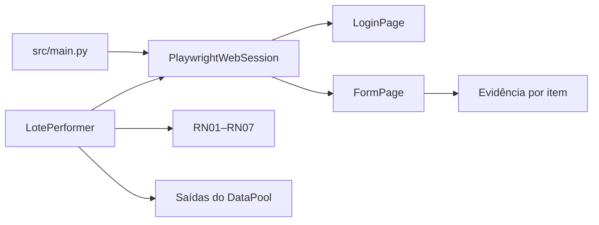

# Aderência da integração Playwright

## Finalidade

Esta matriz relaciona os critérios da integração final à implementação e às
evidências verificáveis.

## Matriz

| Critério | Implementação | Evidência | Situação |
|---|---|---|---|
| Bot executa | `bot.py` e `src/main.py` | suíte e execução local | Atendido |
| DataPool processa itens | Dispatcher, Performer e MaestroClient | testes de integração | Atendido |
| Page Object usado | `LoginPage` e `FormPage` | testes específicos | Atendido |
| Locators robustos | label, role e nome acessível | testes dos Page Objects | Atendido |
| Sem sleeps de interface | waits do Playwright | ausência de pausa na camada web | Atendido |
| Chromium headless | `PlaywrightWebSession.start()` | teste de opções de launch | Atendido |
| Vault no login | `VaultClient` → `LoginPage` | testes de fail-fast e sigilo | Atendido |
| Screenshot por item | `process_item()` e `capture_error()` | testes aprovado/divergência/erro | Atendido |
| Caminho no DataPool | `resultado_validacao`, `evidencia`, `mensagem_resultado` | testes dos gateways | Atendido |
| Falha isolada | `LotePerformer` | teste de continuidade | Atendido |
| Logs gerados | `logging_config.py` | JSON Lines e testes | Atendido |
| Resumo gerado | `ExecutionResult` | JSON e PDF | Atendido |
| README atualizado | `README.md` | fluxo e operação Playwright | Atendido |
| PDD atualizado | `REVISAO_BPMN_PDD.md` | impacto e limites | Atendido |
| `.env` fora do Git | `.gitignore` | inspeção do índice | Atendido |
| Evidências fora do Git | `.gitignore` | diretórios com `.gitkeep` | Atendido |
| Nenhum sistema real | `web/index-lotes/` | aplicação local controlada | Atendido |
| Docker | `Dockerfile` e Compose | build da CI | Atendido |
| Pacote BotCity | script de build | teste de conteúdo | Atendido |
| Revisão cruzada | Pull Request da Issue #39 | aprovação de outro integrante | Pendente até o PR |

## Separação de responsabilidades



- `main.py` prepara e encerra recursos;
- `LotePerformer` controla a unidade de trabalho;
- `validation.py` decide o resultado;
- `PlaywrightWebSession` coordena o navegador;
- os Page Objects concentram locators e ações;
- os gateways persistem o resultado antes da finalização.

## Comandos de validação

```bash
python -m pytest -q
python -m pytest --cov=src --cov-report=term-missing --cov-fail-under=80
git diff --check
git ls-files logs relatorios artefatos dist
```

O último comando deve listar somente:

```text
artefatos/.gitkeep
logs/.gitkeep
relatorios/.gitkeep
```

## Evidências operacionais

Após uma execução com web habilitada, valide:

```text
artefatos/aprovado-<lote>-<timestamp>.png
artefatos/divergencia-<lote>-<timestamp>.png
logs/execucao.log
relatorios/resumo_execucao.json
relatorios/relatorio_evidencias.pdf
```

No Maestro, confirme os três campos de saída do item e os artefatos da task.
Capturas do painel devem ser anexadas à avaliação ou ao Pull Request, sem
versionar dados sensíveis.
