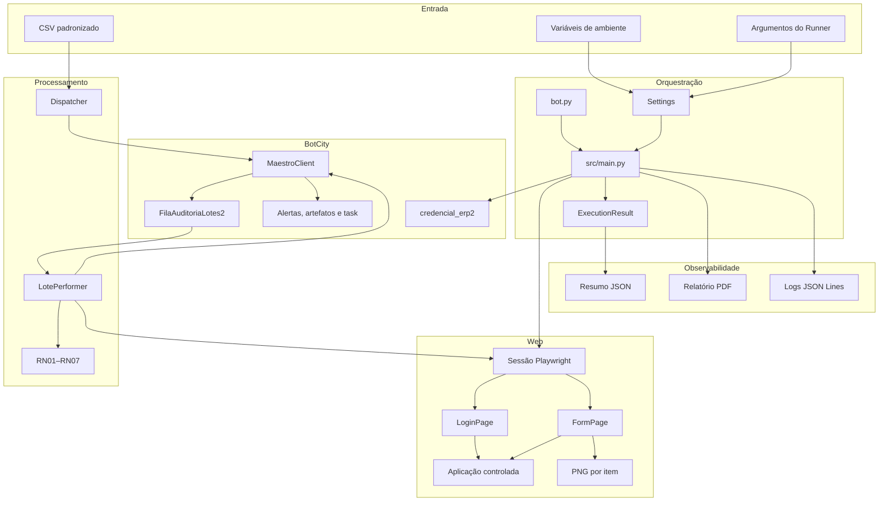
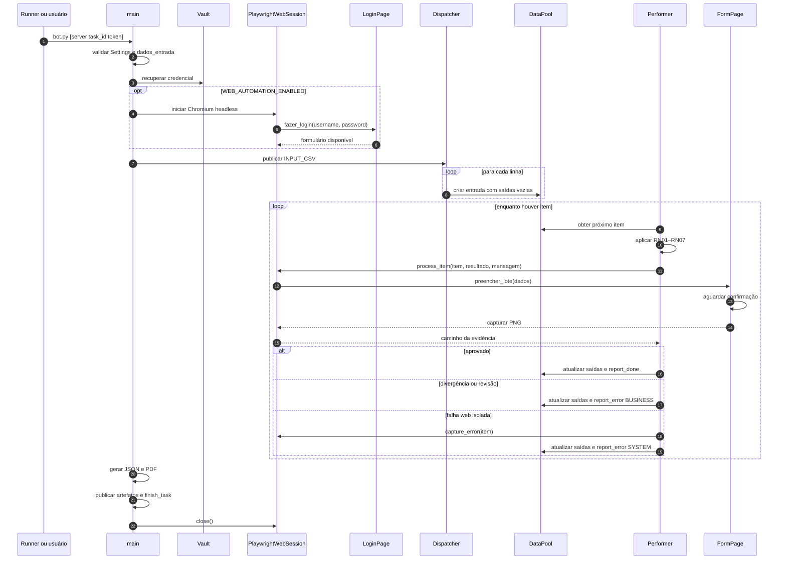
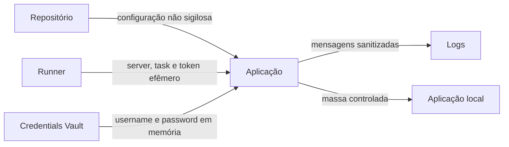

# Arquitetura da automação

## Finalidade

Este documento descreve a solução que executa a conferência de lotes nos modos
local, Docker e BotCity Runner. O BPMN representa o processo de negócio; esta
visão registra componentes, responsabilidades e integração técnica.

## Princípios

- configuração externa e caminhos portáveis;
- credenciais recuperadas somente em runtime;
- falha imediata antes da fila quando o ambiente não é seguro;
- isolamento de divergências e falhas por item;
- regras de negócio independentes da interface;
- locators e ações encapsulados em Page Objects;
- evidência visual e resultado correlacionados ao lote;
- integrações externas acessadas por adaptadores.

## Componentes



## Responsabilidades

| Componente | Responsabilidade |
|---|---|
| `bot.py` | Entry point local e do Runner. |
| `src/config.py` | Carregar ambiente, reconhecer o Runner, resolver caminhos e validar configurações. |
| `src/main.py` | Coordenar fail-fast, Vault, sessão Playwright, Dispatcher, Performer, relatórios e task. |
| `src/dispatcher.py` | Validar o CSV, publicar entradas e reservar os campos de saída. |
| `src/bot.py` | Aplicar o ciclo individual de classificação, interação web e finalização. |
| `src/validation.py` | Aplicar RN01–RN07 sem dependência da infraestrutura ou da interface. |
| `src/web_automation.py` | Gerenciar Playwright, autenticar, delegar o item aos Page Objects e capturar falhas. |
| `src/pages/login_page.py` | Encapsular locators semânticos, waits e autenticação. |
| `src/pages/form_page.py` | Encapsular preenchimento, confirmação e captura da evidência. |
| `src/maestro_client.py` | Adaptar DataPool, alertas, artefatos e finalização da task. |
| `src/vault_client.py` | Recuperar e validar a credencial com cache apenas em memória. |
| `src/logging_config.py` | Produzir JSON Lines e sanitizar dados sensíveis. |
| `src/models.py` | Padronizar o resumo serializável. |

## Page Objects

O limite da camada web segue estas regras:

1. `src/main.py` não conhece locators ou comandos de navegador;
2. `src/web_automation.py` gerencia o runtime, mas não aplica RN01–RN07;
3. `LoginPage` e `FormPage` recebem a mesma `Page` e o mesmo timeout;
4. somente os Page Objects manipulam elementos HTML;
5. os locators priorizam label, role e nome acessível;
6. os waits observam condições, sem pausas fixas;
7. a credencial permanece em memória;
8. página, browser e Playwright são encerrados mesmo após falha.

## Sequência principal



## Contrato do DataPool

Campos de entrada:

```text
lote_id, produto, linha, turno, status, responsavel, data, observacao
```

Campos de saída:

```text
resultado_validacao, evidencia, mensagem_resultado
```

O gateway atualiza os campos de saída antes de chamar `report_done` ou
`report_error`. O caminho da evidência é relativo ao projeto.

## Evidências

| Saída | Destino | Correlação |
|---|---|---|
| PNG aprovado | `artefatos/aprovado-<lote>-<timestamp>.png` | lote e item do DataPool |
| PNG reprovado | `artefatos/reprovado-<lote>-<timestamp>.png` | lote e item do DataPool |
| PNG divergente/revisão | `artefatos/divergencia-<lote>-<timestamp>.png` | lote e item do DataPool |
| PNG de erro | `artefatos/erro-<lote>-<timestamp>.png` | falha técnica isolada |
| Log | `logs/execucao.log` e console | `execution_id`, `bot_id` e evento |
| Resumo | `relatorios/resumo_execucao.json` | execução e lista de evidências |
| PDF | `relatorios/relatorio_evidencias.pdf` | artefato consolidado |

## Modos de execução

| Modo | Gateway | Vault | Navegador | Finalidade |
|---|---|---|---|---|
| Local básico | memória | credencial efêmera | desabilitado | regras e fluxo |
| Local web | memória | credencial efêmera | Playwright Chromium | integração e PNG |
| Docker | memória por padrão | credencial efêmera | `/usr/bin/chromium` | reprodutibilidade |
| Runner | BotCity | Credentials Vault | Chromium configurado ou disponível | homologação |

O ciclo completo de cada item — classificação, interação web e finalização no
DataPool — é isolado. Uma falha inesperada é registrada como erro de sistema e
o Performer tenta continuar o consumo da fila.

## Segurança



- `.env` real não integra o Git, a imagem ou o ZIP;
- a senha não faz parte de `Settings`;
- somente o usuário pode aparecer no log;
- a aplicação web não acessa serviços produtivos;
- arquivos gerados ficam fora do versionamento.

## Modelo de falhas

### Antes da fila

Configuração inválida, entrada ausente, falha de Vault ou falha no login inicial
produzem `FAILED` e impedem a criação do trabalho.

### Durante a fila

- validação de negócio: divergência e continuidade;
- status ambíguo: revisão e continuidade;
- timeout ou falha web: captura de erro, erro de sistema e continuidade;
- falha ao obter o próximo item: falha fatal, pois não há referência segura
  para atualizar.

## Observabilidade

| Evento | Momento |
|---|---|
| `VALIDACAO_ENTRADA` | fail-fast da pasta |
| `VALIDACAO_VAULT` | credencial disponível |
| `PLAYWRIGHT_AMBIENTE` | engine e navegador |
| `INICIO_PLAYWRIGHT` / `FIM_PLAYWRIGHT` | ciclo da sessão |
| `INICIO_ITEM` / `RESULTADO_ITEM` | ciclo do lote |
| `EVIDENCIA_ITEM` | PNG associado |
| `ERRO_WEB_ITEM` | falha isolada |
| `PUBLICACAO_RESULTADOS` | JSON e PDF |
| `ENCERRAMENTO` | sucesso operacional |
| `ERRO_FATAL` | interrupção do ciclo |

## Empacotamento

O ZIP contém:

```text
bot.py
requirements.txt
src/
dados_entrada/
web/index-lotes/
```

Playwright é dependência Python. No Docker, Chromium é instalado na imagem. No
Runner, `PLAYWRIGHT_CHROMIUM_PATH` pode apontar para o navegador homologado; se
ausente, a automação tenta um caminho padrão ou o bundle do Playwright.
