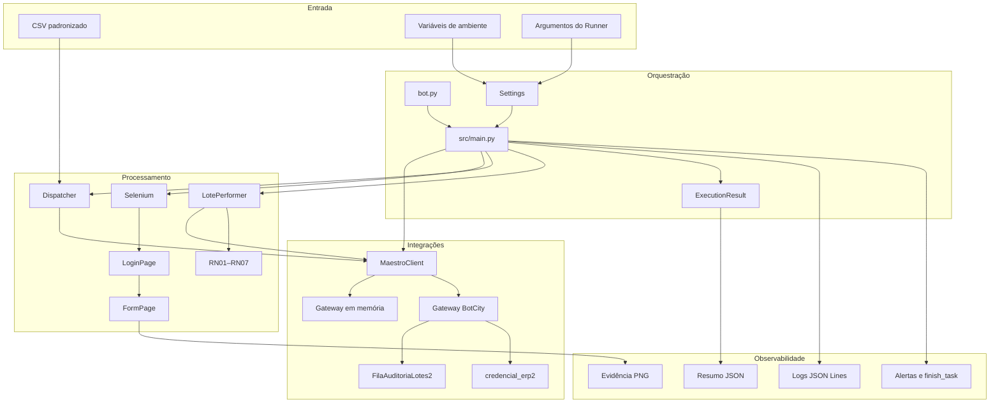
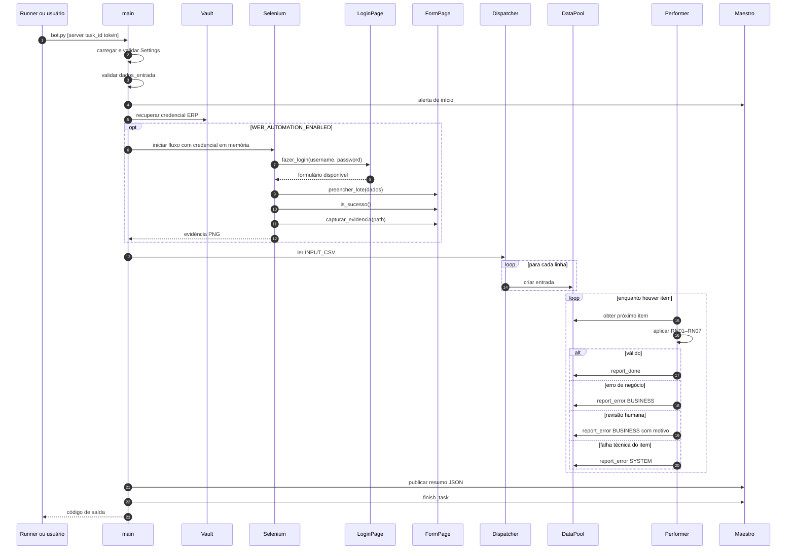
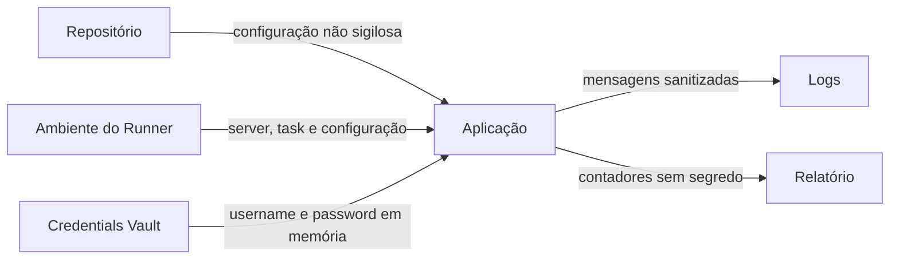

# Arquitetura da automação

## Finalidade

Este documento descreve a arquitetura técnica do projeto Conferência de Lotes,
os limites entre os componentes e o comportamento nos modos local, Docker e
BotCity Runner.

O BPMN representa o processo de negócio. Este documento representa a solução de
software que executa a parte automatizada do fluxo.

## Princípios

- configuração externa ao código;
- credenciais recuperadas somente em tempo de execução;
- fail-fast antes da criação de trabalho na fila;
- isolamento de falhas por item;
- dependências externas acessadas por adaptadores;
- evidências e resultados correlacionados por execução;
- comportamento local reproduzível sem serviços reais.

## Visão de componentes



## Responsabilidades

| Componente | Responsabilidade |
|---|---|
| `bot.py` | Entry point usado localmente e pelo Runner. |
| `src/config.py` | Carregar ambiente, reconhecer argumentos do Runner, resolver caminhos e validar dependências habilitadas. |
| `src/main.py` | Coordenar fail-fast, Vault, Selenium, Dispatcher, Performer, relatório e finalização. |
| `src/dispatcher.py` | Validar o cabeçalho do CSV e publicar uma entrada por linha. |
| `src/maestro_client.py` | Expor uma fachada única para DataPool, alertas, artefatos e task. |
| `src/bot.py` | Consumir a fila e isolar o tratamento de cada item. |
| `src/validation.py` | Aplicar RN01–RN07 sem depender de infraestrutura. |
| `src/vault_client.py` | Recuperar e validar `username` e `password`, com cache apenas em memória. |
| `src/web_automation.py` | Gerenciar o WebDriver e orquestrar os Page Objects sem manipular elementos HTML. |
| `src/pages/login_page.py` | Centralizar locators, waits e ações da autenticação web. |
| `src/pages/form_page.py` | Centralizar locators, waits, preenchimento, validação e captura da evidência do formulário. |
| `src/logging_config.py` | Produzir JSON Lines e sanitizar dados sensíveis. |
| `src/models.py` | Padronizar o resumo serializável da execução. |

## Sequência principal



## Modos de execução

| Modo | Gateway | Vault | Selenium | Finalidade |
|---|---|---|---|---|
| Local básico | Em memória | Credencial efêmera | Desabilitado | Desenvolvimento das regras e do fluxo. |
| Local com web | Em memória | Credencial efêmera | Chrome local | Validação do formulário e da evidência. |
| Docker | Em memória por padrão | Credencial efêmera | Chromium da imagem | Reprodutibilidade e validação de container. |
| BotCity Runner | BotCity Maestro | Credentials Vault | Binários homologados no host | Execução integrada e rastreável. |

## Limites de segurança



- `.env` real não integra o pacote nem o repositório;
- a senha não pertence à classe `Settings`;
- apenas o nome do usuário pode aparecer no log;
- o formatador mascara atribuições e valores sensíveis;
- o pacote não inclui logs, relatórios, evidências ou caches locais.

## Modelo de falhas

### Antes da fila

Configuração inválida, entrada ausente, falha de Vault, Selenium ou Dispatcher
impedem o ciclo normal. O resultado é `FAILED`, com log estruturado e tentativa
de finalizar a task.

### Durante o consumo

Cada item possui tratamento independente:

- `ValidationError`: erro de negócio;
- `HumanReviewStatus`: revisão humana;
- exceção inesperada: erro de sistema;
- falha ao obter o próximo item: erro técnico fatal, pois não existe uma
  referência segura para finalizar no DataPool.

### Resultado operacional

Erros de negócio não transformam a automação em falha técnica. O resumo pode ser
`PARTIALLY_COMPLETED`, enquanto a task é encerrada como sucesso operacional.

## Observabilidade

Os eventos mais relevantes são:

| Evento | Momento |
|---|---|
| `VALIDACAO_CONFIGURACAO` | Configuração inválida. |
| `VALIDACAO_ENTRADA` | Fail-fast da pasta de entrada. |
| `VALIDACAO_VAULT` | Credencial disponível. |
| `SELENIUM_AMBIENTE` | Binários e versões usados no Runner. |
| `AUTOMACAO_WEB` | Formulário confirmado e evidência gerada. |
| `PUBLICACAO_DATAPOOL` | Linhas publicadas. |
| `PROCESSAMENTO_LOTE` | Falha técnica de um item. |
| `FIM_PROCESSAMENTO` | Contadores consolidados. |
| `ENCERRAMENTO` | Sucesso operacional do ciclo. |
| `ERRO_FATAL` | Falha que encerra a execução. |

`BOT_ID` identifica a automação e `EXECUTION_ID` correlaciona todos os eventos
de uma execução. No Runner, o `task_id` é usado como `EXECUTION_ID`.

## Empacotamento

O pacote Python contém:

```text
bot.py
requirements.txt
src/
dados_entrada/
web/index-lotes/
```

Chrome e ChromeDriver são dependências do host do Runner, não do ZIP. O pacote
homologado utiliza `/usr/bin/google-chrome` e
`/usr/local/bin/chromedriver`.

## Manutenção

Ao alterar uma regra ou integração:

1. atualize os testes do módulo;
2. confirme os efeitos no Dispatcher, Performer e resumo;
3. revise os eventos de log;
4. valide o modo local sem credenciais;
5. valide Docker quando houver dependência de sistema;
6. gere e inspecione o pacote quando houver impacto no Runner;
7. atualize o BPMN somente se o processo de negócio mudar;
8. atualize este documento quando limites ou sequências forem alterados.
