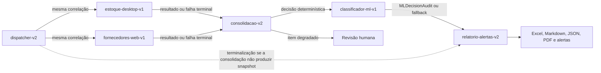
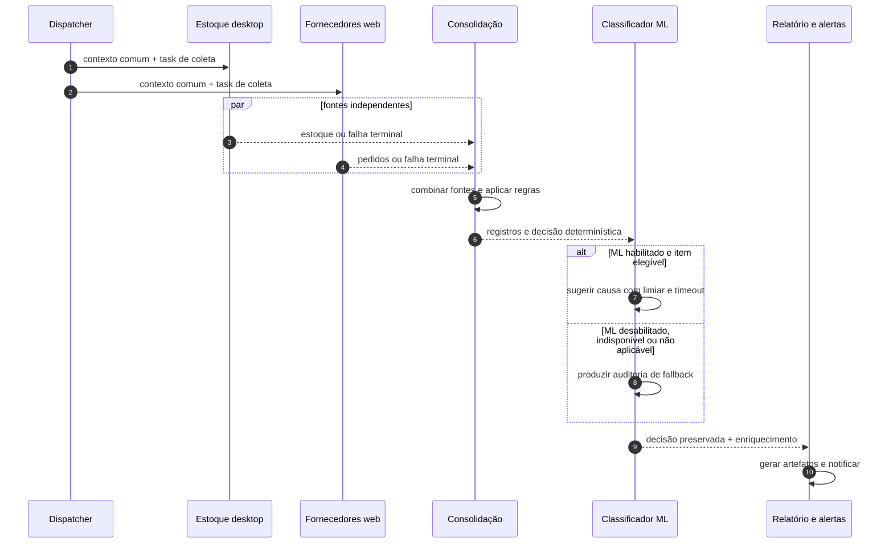

# Arquitetura-alvo do Capstone de hiperautomação

## Status do documento

| Item | Valor |
|---|---|
| Issue | `#109` |
| Natureza | Arquitetura-alvo; não representa seis bots já implantados |
| Estado atual | Três estágios no BotCity Maestro |
| Estado-alvo | Seis bots híbridos preparados para o Smart Office |
| Regra central | A decisão operacional é determinística; o ML apenas enriquece divergências |

Este documento estabelece os limites e os contratos que as próximas entregas
devem implementar. A arquitetura atual continua descrita em
[`ARQUITETURA.md`](ARQUITETURA.md), e a operação legada de três bots permanece
válida durante a migração.

## Decisões arquiteturais

1. O pipeline final possui exatamente seis papéis operacionais independentes.
2. As coletas desktop e web começam a partir do mesmo contexto e não dependem
   uma da outra.
3. A consolidação é um ponto de *fan-in*: aguarda as duas coletas até os limites
   configurados e conhece o estado terminal de ambas.
4. RN01–RN12 e as regras de cruzamento determinísticas definem o status do item
   antes da etapa de ML.
5. O ML somente sugere a causa provável de uma divergência. Desabilitá-lo ou
   perdê-lo não impede a conclusão do lote.
6. A etapa de relatório recebe os resultados anteriores; ela não repete coleta,
   validação nem chamada ao modelo.
7. Falha de item, falha de dependência e falha da execução são estados distintos.
8. As integrações externas permanecem atrás de adaptadores testáveis em memória.
9. Os nomes abaixo são aliases versionados. O mapeamento para `activity_label`,
   filas, credenciais e Runners do ambiente permanece em configuração protegida.

## Evolução sem descarte do sistema atual

| Capacidade atual | Reutilização no Capstone | Extensão planejada |
|---|---|---|
| `src/orchestrator.py` com três estágios | Correlação, `StageResult` e gateway | Fan-out, fan-in, seis papéis, prioridade e adaptador Smart Office |
| `src/wait_for_predecessor.py` | Polling, timeout e estados terminais | Aguardar uma coleção de predecessores |
| Playwright e Page Objects | Sessão, locators, waits e evidências | Portal de fornecedores como bot independente |
| RN01–RN12 e `RegistroValidado` | Precedência e `regra_aplicada` | Receber dados combinados das duas fontes |
| `ClassificadorDivergencia` | Feature flag, limiar, timeout e fallback | Ponto de entrada próprio como bot não crítico |
| `MLDecisionAudit` | Origem, confiança, fallback e latência | Propagação entre tasks sem nova inferência |
| Relatórios Excel, Markdown, JSON e PDF | Saídas e indicadores existentes | Situação das fontes e modo degradado |
| `SistemaAlertas` | Telegram, Email e log local | Anexo e alertas de degradação prolongada |
| `LinearRetryPolicy` | Retry determinístico | Aplicação às duas coletas críticas |
| `DeadLetterWriter` | Persistência sanitizada e idempotente | Receber falhas irrecuperáveis do fluxo consolidado |

## Os seis bots

| Ordem | Alias versionado | Responsabilidade | Criticidade | Prioridade lógica |
|---:|---|---|---|---|
| 1 | `dispatcher-v2` | Abrir a execução, validar o contexto e disparar as duas coletas. | Crítica | Alta |
| 2 | `estoque-desktop-v1` | Consultar o sistema legado simulado exclusivamente pela interface gráfica. | Crítica com fallback | Máxima; exige sessão gráfica |
| 3 | `fornecedores-web-v1` | Consultar pedidos no portal controlado com Playwright e Page Objects. | Crítica com fallback | Alta |
| 4 | `consolidacao-v2` | Combinar as fontes, executar regras e definir o status operacional. | Crítica | Alta |
| 5 | `classificador-ml-v1` | Sugerir causa provável para divergências elegíveis. | Opcional | Normal |
| 6 | `relatorio-alertas-v2` | Gerar saídas, publicar artefatos e notificar o resultado. | Crítica para encerramento | Alta |

"Crítica com fallback" significa que a fonte é necessária para uma decisão
completa, mas sua indisponibilidade não pode deixar o pipeline pendurado. A
execução continua de forma degradada, encaminha os itens afetados para revisão
e torna a indisponibilidade visível no relatório e nos alertas.

## Fluxo de tasks



O Smart Office pode oferecer uma dependência múltipla nativa ou exigir que a
consolidação consulte as duas tasks. Essa diferença pertence ao adaptador. Para
o domínio, `consolidacao-v2` sempre recebe os dois resultados terminais e nunca
faz espera infinita. Se a própria consolidação não produzir resultado, o papel
de coordenação do Dispatcher cria um snapshot sintético de falha e dispara
`relatorio-alertas-v2`; isso não cria um sétimo bot.

## Sequência nominal



## Envelope comum de integração

Toda transição usa JSON serializável e inclui o envelope abaixo. Os campos já
existentes em `OrchestrationContext` são preservados; os campos plurais atendem
ao fan-in sem quebrar a cadeia legada.

| Campo | Tipo | Obrigatório | Regra |
|---|---|---:|---|
| `schema_version` | string | sim | Inicia em `1.0`; evolução incompatível exige nova versão. |
| `execution_id` | string | sim | Identifica a execução de negócio ponta a ponta. |
| `correlation_id` | string | sim | É criado uma vez pelo Dispatcher e nunca muda. |
| `root_task_id` | string | sim | Task raiz da cadeia. |
| `task_id` | string | sim | ID real da task que produziu o envelope; nunca é sintetizado. |
| `parent_task_id` | string ou nulo | sim | Compatibilidade com o encadeamento atual. |
| `predecessor_task_ids` | lista de strings | sim | Contém somente IDs reais; pode ter zero, um ou dois elementos no fan-in. |
| `bot_id` | string | sim | Alias do produtor. |
| `trigger_bot` | string | sim | Alias que criou ou liberou a task. |
| `timestamp` | string ISO 8601 UTC | sim | Nunca utiliza horário local sem fuso. |
| `status` | string | sim | Estado terminal técnico da etapa. |
| `origem_dados` | lista de strings | sim | Valores controlados `desktop`, `web`, `regras`, `ml` ou `fallback`. |
| `modo_degradado` | boolean | sim | `true` quando uma dependência não entregou o resultado nominal. |
| `motivo_fallback` | string ou nulo | sim | Motivo controlado; nulo no caminho nominal. |
| `attempts` | inteiro | sim | Total de tentativas da operação principal. |
| `payload` | objeto | sim | Contrato específico do produtor. |
| `artifacts` | lista de objetos | sim | Nome, tipo, caminho ou identificador e checksum quando disponível. |

Exemplo mínimo:

```json
{
  "schema_version": "1.0",
  "execution_id": "exec-2026-08-26-001",
  "correlation_id": "corr-001",
  "root_task_id": "task-dispatcher-001",
  "task_id": "task-desktop-001",
  "parent_task_id": "task-dispatcher-001",
  "predecessor_task_ids": ["task-dispatcher-001"],
  "bot_id": "estoque-desktop-v1",
  "trigger_bot": "dispatcher-v2",
  "timestamp": "2026-08-26T14:00:00+00:00",
  "status": "SUCCESS",
  "origem_dados": ["desktop"],
  "modo_degradado": false,
  "motivo_fallback": null,
  "attempts": 1,
  "payload": {},
  "artifacts": []
}
```

### Resultado sintético quando uma task não é criada

Não se fabrica `task_id` para uma task rejeitada pelo orquestrador. O Dispatcher
registra um resultado sintético no manifesto do fan-out, usando a mesma
`schema_version`, `execution_id` e `correlation_id` da execução:

```json
{
  "source_alias": "estoque-desktop-v1",
  "task_created": false,
  "task_id": null,
  "synthetic": true,
  "status": "FAILED",
  "source_status": "UNAVAILABLE",
  "motivo_fallback": "task_creation_failed",
  "attempts": 1,
  "failure_type": "ORCHESTRATION",
  "failure_message": "Não foi possível criar a task da coleta desktop"
}
```

Esse objeto não é um envelope órfão. Ele fica em
`payload.fanout_results[source_alias]` dentro do envelope real produzido pelo
Dispatcher, cujo `task_id` continua sendo o ID verdadeiro da task raiz. O
envelope do Dispatcher termina como `PARTIALLY_COMPLETED` quando qualquer
criação falha de forma controlada, inclusive quando as duas coletas não são
criadas, pois ainda precisa liberar a consolidação de contingência. O
`status=FAILED` acima pertence exclusivamente à fonte que não pôde ser criada.
Somente o campo aninhado `fanout_results[source_alias].task_id` recebe `null`.

`failure_message` é sanitizada e não contém a mensagem bruta do SDK quando ela
puder expor dados do ambiente. `task_creation_failed` é um motivo controlado e
distinto de `timeout`, `canceled` e `source_unavailable`.

O manifesto `payload.fanout_results` sempre possui as chaves
`estoque-desktop-v1` e `fornecedores-web-v1`. `predecessor_task_ids`, por outro
lado, lista apenas as tasks efetivamente criadas. Portanto:

- duas criações bem-sucedidas produzem dois IDs reais;
- uma falha de criação produz um ID real e um resultado sintético;
- duas falhas de criação produzem lista vazia e dois resultados sintéticos.

A consolidação aguarda somente os IDs reais e combina esses estados com os
resultados sintéticos do manifesto. Assim, identifica a fonte ausente pelo
`source_alias`, sem consultar um ID inexistente e sem aguardar indefinidamente.

### Estados técnicos e estados de negócio

Os dois conjuntos não podem ocupar o mesmo campo:

| Camada | Estados controlados | Uso |
|---|---|---|
| Task/dependência | `SUCCESS`, `PARTIALLY_COMPLETED`, `FAILED`, `CANCELED`, `TIMEOUT` | Decidir se a etapa seguinte executa nominal, degradada ou apenas para encerrar e alertar. |
| Fonte | `AVAILABLE`, `DEGRADED`, `UNAVAILABLE` | Informar a qualidade da coleta desktop ou web. |
| Item | `VALIDO`, `DIVERGENCIA`, `PENDENTE_REVISAO` e classificações RN01–RN12 já existentes | Representar a decisão de negócio. |

`CANCELED` e `TIMEOUT` descrevem a dependência observada. A implementação pode
continuar convertendo exceções de espera em um `StageResult` terminal, desde
que não confunda esses estados com uma divergência de negócio.

## Contratos específicos

### 1. Dispatcher

Entrada:

- parâmetros do Runner;
- configuração não sigilosa;
- referência da massa de trabalho.

Saída em `payload`:

```text
input_reference, expected_items, requested_at, desktop_task_id, web_task_id
```

O Dispatcher cria o `execution_id` e o `correlation_id`. As duas tasks filhas
recebem exatamente esses identificadores.

### 2. Coleta de estoque desktop

Uma linha de `payload.records` contém:

```text
lote_id, produto, quantidade_disponivel, localizacao,
status_estoque, atualizado_em
```

Metadados adicionais:

```text
source_status, collected_items, failed_items, latency_ms, evidence_paths
```

Os dados são obtidos pela interface gráfica. Arquivo interno, banco ou API do
simulador não podem ser usados como atalho pelo bot.

### 3. Coleta de fornecedores web

Uma linha de `payload.records` contém:

```text
pedido_id, lote_id, fornecedor, produto, quantidade_solicitada,
status_pedido, data_prevista
```

Metadados adicionais:

```text
source_status, collected_items, failed_items, latency_ms, evidence_paths
```

Playwright e Page Objects continuam sendo a única fronteira de interação com o
portal controlado.

### 4. Consolidação e decisão determinística

Entrada:

```text
desktop_result, web_result, source_statuses
```

Uma linha de `payload.records` preserva o resultado compatível com
`RegistroValidado` e acrescenta:

```text
pedido_id, quantidade_disponivel, quantidade_solicitada,
origens_consultadas, fontes_ausentes, modo_degradado
```

A saída obrigatoriamente conserva:

```text
classificacao, motivo, regras_violadas, regra_aplicada
```

As verificações de cruzamento entre estoque e pedido devem receber códigos e
precedência documentados antes da implementação; códigos RN01–RN12 não serão
reutilizados com outro significado.

### 5. Classificação ML

Entrada:

```text
lote_id, observacao, resultado_deterministico
```

Saída compatível com `ResultadoClassificacaoDivergencia` e
`MLDecisionAudit`:

```text
causa_provavel, confianca_ml, origem_decisao,
motivo_fallback, latencia_ms, resultado_aplicado
```

`resultado_aplicado` é sempre a decisão recebida da consolidação. A resposta do
modelo não promove nem rebaixa um item. Itens não elegíveis não provocam chamada
HTTP e ainda produzem um resultado terminal compreensível para a task.

### 6. Relatório e alertas

Entrada:

```text
report_type, consolidation_result, ml_result, source_statuses
```

Saída:

```text
report_paths, summary_path, notification_results,
total_items, processed_items, failed_items, review_items
```

Excel, Markdown, JSON, PDF, logs e notificações consomem o mesmo snapshot da
execução. A etapa não relê a interface, não recalcula regras e não chama o ML.

`consolidation_result` é sempre uma chave obrigatória, mas pode conter um
snapshot real ou sintético. `report_type` diferencia os dois produtos:

| `report_type` | Condição | Artefato |
|---|---|---|
| `BUSINESS` | A consolidação produziu registros, ainda que em modo degradado. | Relatórios operacionais existentes, com fontes e degradação explícitas. |
| `OPERATIONAL_INCIDENT` | Não existe decisão consolidada utilizável. | Resumo de incidente JSON/Markdown/PDF e alerta; não publica indicadores como se fossem resultados de negócio. |

### Snapshot mínimo de falha operacional

Quando `consolidacao-v2` termina em erro, é cancelada, excede o timeout ou falha
antes de serializar sua saída, o coordenador de orquestração pertencente ao
papel `dispatcher-v2` cria `consolidation_result` sintético e agenda
`relatorio-alertas-v2` em modo de incidente.

O snapshot mínimo possui obrigatoriamente:

```text
schema_version, execution_id, correlation_id, root_task_id,
snapshot_type, status, generated_at, expected_items,
processed_items, failed_items, review_items, source_statuses,
failure_stage, failure_type, failure_code, failure_message,
failed_task_id, motivo_fallback, available_artifacts
```

Regras do snapshot:

- `snapshot_type=OPERATIONAL_FAILURE`;
- `status=FAILED`;
- `processed_items=0` quando nenhuma decisão foi materializada;
- `failed_items` e `review_items` usam `expected_items` quando conhecido;
- `failed_task_id` contém o ID real da consolidação ou `null` quando nem essa
  task pôde ser criada;
- `failure_code` usa valor controlado, como `consolidation_failed`,
  `consolidation_canceled`, `consolidation_timeout` ou
  `consolidation_task_creation_failed`;
- `failure_message` é curta e sanitizada;
- `available_artifacts` preserva somente evidências já produzidas pelas fontes;
- `ml_result` informa `not_executed_due_upstream_failure`, sem chamada ao modelo.

O Dispatcher não calcula regras nem números de negócio nesse caminho. Ele
apenas materializa os metadados mínimos que já conhece para permitir o
encerramento, a auditoria e o alerta. Se o Dispatcher não conseguir criar a
task de relatório, utiliza `SistemaAlertas` e o log local como terminalização
de último recurso.

## Fan-out, fan-in e prioridade

### Fan-out

Após validar o contexto, o Dispatcher cria as tasks desktop e web. Falha ao
criar uma delas produz o resultado sintético definido neste documento; a outra
não é cancelada automaticamente se puder produzir evidência útil. Ao terminar
as duas tentativas de criação, o Dispatcher persiste `fanout_results` e cria a
task de consolidação mesmo que uma ou ambas as listas de coleta estejam vazias.

### Fan-in

A consolidação recebe `predecessor_task_ids` somente com as tasks criadas e
`fanout_results` com exatamente um resultado por alias. Para cada dependência
real, registra:

```text
task_id, status, finish_message, completed_at, payload_reference
```

O timeout global e o timeout por dependência são configuráveis. A implementação
deve esperar por condição e nunca usar repetição infinita. Resultados sintéticos
são terminais desde a origem e nunca entram no polling.

### Prioridade

`estoque-desktop-v1` possui a maior prioridade lógica porque depende de uma
sessão gráfica exclusiva e escassa. O valor numérico ou enum usado pelo Smart
Office pertence à configuração do ambiente, não ao domínio nem a este documento.

## Matriz de falhas e continuidade

| Situação | Estado esperado | Continuidade |
|---|---|---|
| Desktop nominal e web nominal | `SUCCESS` | Consolidação completa. |
| Criação de uma coleta rejeitada | Resultado sintético `FAILED` e fonte `UNAVAILABLE` | A outra coleta continua; consolidação usa o manifesto e encaminha o item para revisão. |
| Criação das duas coletas rejeitada | Dois resultados sintéticos e nenhum predecessor real | Consolidação gera snapshot de falha; relatório de incidente é produzido. |
| Uma fonte indisponível após retry | `PARTIALLY_COMPLETED` | Itens afetados vão para revisão; relatório e alerta explicitam degradação. |
| As duas fontes indisponíveis | `FAILED` | Consolidação materializa snapshot de falha; relatório de incidente e alerta são produzidos. |
| Consolidação sem resultado serializável | Snapshot sintético `OPERATIONAL_FAILURE` | Dispatcher cria a task de relatório em modo de incidente. |
| Item inválido irrecuperável | Item em erro/dead letter | Demais itens continuam. |
| ML desabilitado | `SUCCESS` com `origem_decisao=fallback` | Resultado determinístico preservado. |
| ML indisponível, timeout ou resposta inválida | `PARTIALLY_COMPLETED` ou sucesso operacional com aviso | Relatório recebe motivo específico; lote conclui. |
| Relatório principal falha | `FAILED` | Alertar com o resumo mínimo disponível, sem fingir que o artefato existe. |
| Telegram falha | Canal com falha | Email é tentado; depois, log local. |
| Predecessor cancelado | `CANCELED` observado | Não aguardar indefinidamente; executar encerramento controlado. |
| Predecessor excede o limite | `TIMEOUT` observado | Aplicar política degradada ou falhar conforme criticidade. |

## Rastreabilidade e auditoria

Todos os bots registram, no mínimo:

```text
timestamp, evento, status, bot_id, task_id, execution_id,
correlation_id, root_task_id, predecessor_task_ids, attempts,
latency_ms, modo_degradado, motivo_fallback
```

Artefatos e decisões de ML carregam os mesmos identificadores. Observações
livres, tokens, senhas e chaves não aparecem em logs, dead letter, relatórios
públicos ou capturas.

## Limites de responsabilidade

- Bots de interface coletam e evidenciam; não aplicam regras de negócio.
- A consolidação decide; não abre navegador, desktop, canal de alerta ou API ML.
- O classificador enriquece; não altera status nem precedência.
- O relatório apresenta um snapshot; não reconstrói decisões.
- O adaptador de orquestração traduz contratos do domínio para Maestro ou Smart
  Office; o domínio não importa SDKs externos.
- Credenciais são recuperadas em runtime e permanecem fora dos payloads.

## Implementação incremental

| Entrega seguinte | Contrato consumido | Resultado esperado |
|---|---|---|
| Bot desktop | Envelope + contrato de estoque | Coleta visual isolada e resiliente. |
| Bot web | Envelope + contrato de pedidos | Coleta Playwright isolada e resiliente. |
| Consolidação | Dois resultados de fonte | Decisão determinística rastreável. |
| Bot de ML | Resultado consolidado | Auditoria ML ou fallback sem alterar status. |
| Orquestração | Todos os envelopes | Fan-out, fan-in, prioridade e timeout. |
| Relatório/alertas | Snapshot consolidado | Artefatos e comunicação sem novo processamento. |

Até que cada entrega seja concluída e homologada, a cadeia de três bots no
Maestro continua sendo a implementação oficial do repositório.
