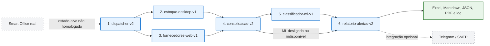
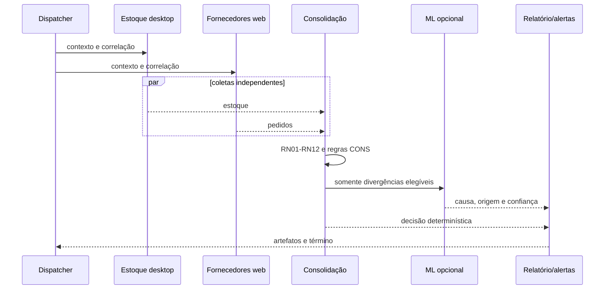
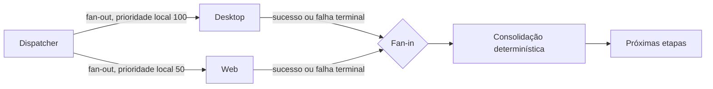
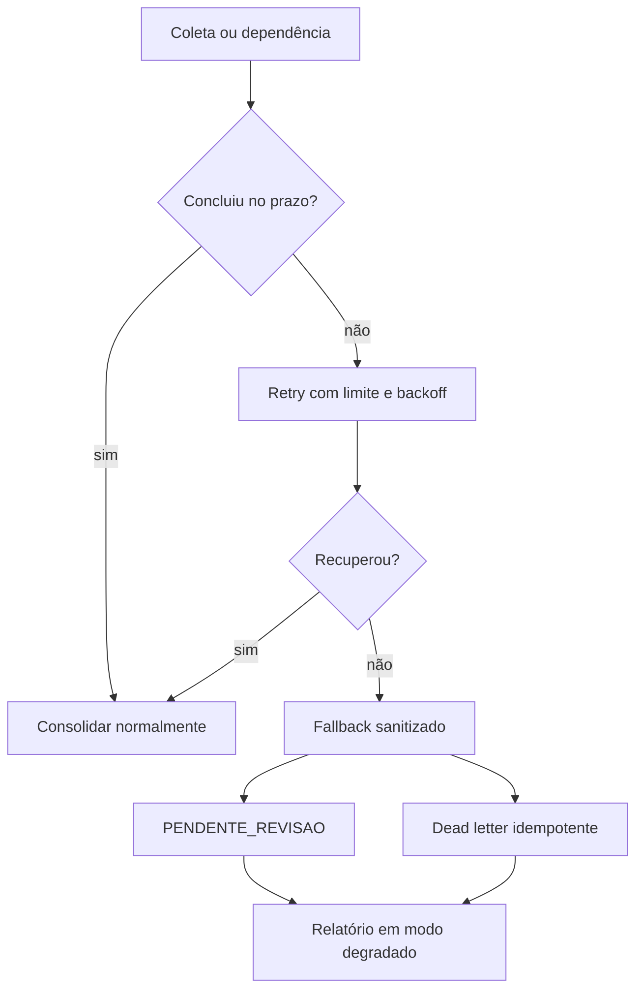
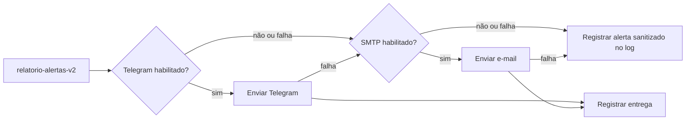
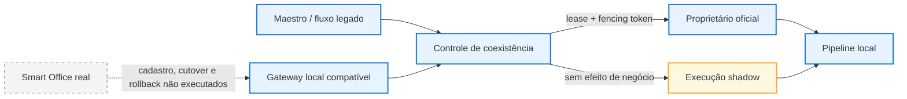

# Diagramas finais do Capstone

## Legenda de estado

- **Azul/verde e linha contínua:** implementado e executado localmente.
- **Cinza e linha tracejada:** integração externa preparada, mas não executada.
- **Amarelo:** continuidade degradada ou revisão humana.

Nenhum diagrama desta página representa cadastro, deploy ou homologação no
Smart Office real.

## Arquitetura dos seis bots

## Sequência nominal

## Fan-out e fan-in

A escala local usa números maiores para maior prioridade. Na configuração-alvo
do Smart Office a escala documentada é inversa: `1` é a maior prioridade e `5`
a menor. O adaptador traduz a prioridade; o domínio não depende dessa escala.

## Continuidade degradada

## Fallback de alertas

Telegram e SMTP são integrações opcionais configuradas por `.env` local. O log
é o fallback sempre disponível e é a evidência reproduzível do repositório.

## Coexistência local e estado-alvo

O lease persistente, a exclusão mútua e o modo `shadow` foram validados
localmente. Cutover, rollback e cadastro no Smart Office permanecem como
procedimentos preparados para execução futura por uma equipe com acesso.
