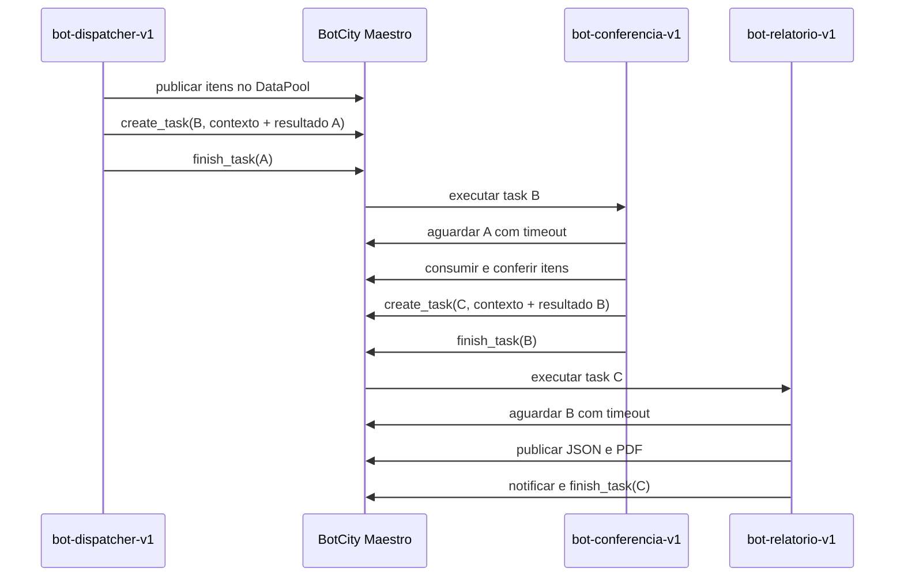

# Orquestração de três bots no Maestro

## Objetivo

Este guia descreve o encadeamento rastreável das três etapas da conferência de
lotes. Os testes usam o gateway em memória; somente a homologação final acessa
o BotCity Maestro real.

## Bots e responsabilidades

| Ordem | Alias documental | Responsabilidade |
|---|---|---|
| A | `bot-dispatcher-v1` | Ler o CSV e publicar os itens no DataPool. |
| B | `bot-conferencia-v1` | Consumir os itens, aplicar as regras e enriquecer divergências com ML. |
| C | `bot-relatorio-v1` | Publicar JSON, PDF e notificar a conclusão da cadeia. |

Os três registros podem receber o mesmo pacote ZIP. O estágio é selecionado
pelo `activity_label` da task atual, mantendo uma única base de código. O
`BOT_ID` fica disponível apenas como fallback para testes locais sem Maestro.
Os aliases da tabela preservam os papéis sem publicar o mapeamento operacional;
na implantação, use os labels autorizados para o ambiente.

## Encadeamento



A próxima task é criada antes da finalização da atual. Como o Runner pode
iniciá-la imediatamente, `src/wait_for_predecessor.py` consulta o predecessor
até um estado terminal ou até o timeout configurado.

## Parâmetros propagados

Cada chamada de `create_task()` envia:

| Campo | Conteúdo |
|---|---|
| `correlation_id` | UUID comum às três etapas. |
| `root_task_id` | ID da task do Bot A. |
| `parent_task_id` | ID da task que criou a etapa atual. |
| `trigger_bot` | Label do bot que disparou a task. |
| `previous_result` | Status, mensagem, contadores e payload da etapa anterior. |

O resultado não contém senha, token, chave do Maestro ou credencial do ERP.

## Configuração comum

```text
MAESTRO_ENABLED=true
VAULT_ENABLED=true
ORCHESTRATION_ENABLED=true
ORCHESTRATION_TIMEOUT_SECONDS=300
ORCHESTRATION_POLL_INTERVAL_SECONDS=2
DATAPOOL_LABEL=FilaAuditoriaLotes2
VAULT_LABEL=credencial_erp2
```

Os papéis são representados publicamente por estes aliases:

```text
bot-dispatcher-v1
bot-conferencia-v1
bot-relatorio-v1
```

Não copie os aliases para produção. Associe cada papel ao `activity_label`
autorizado no ambiente de implantação.

O Bot B utiliza as configurações de Vault, Playwright e ML já documentadas. O
Bot A precisa acessar o CSV empacotado e o Bot C precisa escrever no diretório
de relatórios.

## Publicação

1. Gere e inspecione o pacote:

   ```bash
   python scripts/build_botcity_package.py --version 2
   unzip -l dist/bot-conferencia-de-lotes-v2.zip
   ```

2. Registre os três bots com os labels autorizados correspondentes aos papéis.
3. Envie o mesmo ZIP para os três registros.
4. Configure as variáveis comuns; não é necessário injetar um `BOT_ID`
   diferente em cada execução.
5. Mantenha a credencial ERP somente no Credentials Vault.
6. Libere as versões e mantenha um Runner compatível disponível.
7. Crie manualmente apenas uma task para a atividade Dispatcher autorizada.

Bots B e C não devem ser iniciados manualmente durante o teste da cadeia. Eles
são criados pelas chamadas de `create_task()`.

## Logs esperados

Cada bot registra os eventos:

```text
INICIO_BOT
AGUARDANDO_PREDECESSOR
PROXIMA_TASK_CRIADA
FIM_BOT
```

O Bot A não emite `AGUARDANDO_PREDECESSOR` e o Bot C não emite
`PROXIMA_TASK_CRIADA`. Em cada registro, confira em `detalhes`:

```text
correlation_id
root_task_id
parent_task_id
current_task_id
trigger_bot
orchestration_stage
next_task_id
```

## Falhas e timeout

- predecessor `FAILED` ou `CANCELED`: a etapa dependente não executa;
- predecessor ainda ativo após o timeout: a etapa termina como `FAILED`;
- falha no trabalho da etapa: nenhuma próxima task é criada;
- falha terminal: `finish_task()` recebe uma mensagem compreensível;
- `PARTIALLY_COMPLETED`: o relatório ainda é executado e preserva os contadores.

## Validação automatizada

```bash
python -m pytest tests/unit/test_orchestrator.py -v
python -m pytest tests/integration/test_orchestration_pipeline.py -v
python -m ruff check --select E4,E7,E9,F src tests
python -m ruff check src/orchestrator.py src/wait_for_predecessor.py \
  tests/unit/test_orchestrator.py \
  tests/integration/test_orchestration_pipeline.py
```

O teste de integração executa publicação, consumo e relatório com um gateway
falso. Ele não usa rede, credenciais ou o Maestro real.

## Evidência no painel

Após a homologação real:

1. abra as três tasks no painel do Maestro;
2. anote os três `task_id`;
3. confirme o mesmo `correlation_id` nos logs;
4. confirme A como pai de B e B como pai de C;
5. confirme o `trigger_bot` de B e C;
6. confirme os três estados terminais;
7. capture uma imagem mostrando os três bots e seus `task_id`;
8. preserve também os trechos JSON de `INICIO_BOT` e `FIM_BOT`.

A captura real deve ser coletada após o deploy; ela não é fabricada pelos
testes automatizados.
