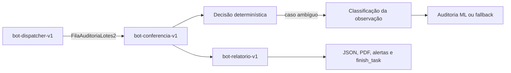

# Revisão do BPMN e do PDD

## Registro

| Item | Informação |
|---|---|
| Data | 25 de agosto de 2026 |
| Escopo | BPMN, RN01–RN12, DataPool, Playwright, arquitetura híbrida S10-B, três bots, resiliência, alertas e saídas analíticas |
| BPMN | `docs/diagrama_pdd.bpmn` |
| Visualização | `docs/diagrama_pdd.svg` |
| Regras-base | `docs/Regras de validação a aplicar - Gabriel, Marcelo e Rebecca.docx.pdf` |
| Massa-base | `docs/Inspeção de Lotes - Gabriel, Marcelo e Rebecca.xlsx` |

## Objetivo

Confirmar que o processo e as regras continuam coerentes após a integração da
automação Playwright ao processamento individual do DataPool.

## Aderência

| Elemento do processo | Implementação | Situação |
|---|---|---|
| Receber planilha | A execução começa com CSV em `dados_entrada/`. | Parcial; e-mail e conversão permanecem externos. |
| Validar estrutura | Dispatcher e RN01–RN02. | Atendido. |
| Verificar referência | RN03 usa `REFERENCE_LOTES`. | Atendido. |
| Normalizar status | RN05 normaliza `OK` e `NOK`. | Atendido. |
| Separar ambiguidade | RN06 encaminha para revisão. | Atendido. |
| Continuar após falha | `LotePerformer` isola cada item. | Atendido. |
| Exigir observação | RN07 valida reprovação. | Atendido. |
| Interagir com sistema | Aplicação local por Playwright e Page Objects. | Atendido no ambiente controlado. |
| Produzir evidência | PNG aprovado, reprovado, divergente ou erro por item. | Atendido. |
| Atualizar resultado | Três campos de saída no DataPool. | Atendido. |
| Consolidar execução | JSON, PDF e logs estruturados. | Atendido. |

## Rastreabilidade das regras

| Regra | Código | Resultado |
|---|---|---|
| RN01 | `validate_columns` | erro de negócio |
| RN02 | `validate_required_fields` | erro de negócio |
| RN03 | `validate_lote_in_reference` | erro de negócio |
| RN04 | `validate_status` | erro de negócio |
| RN05 | `normalize_status` | status normalizado |
| RN06 | `HumanReviewStatus` | revisão humana |
| RN07 | `validate_observation_for_reproved` | erro de negócio |

## Decisões consolidadas

1. Cada linha do CSV representa um item do DataPool.
2. O DataPool é `FilaAuditoriaLotes2`.
3. A credencial é `credencial_erp2`.
4. `APROVADO` e `REPROVADO` são os estados finais de negócio.
5. Um estado ambíguo não é transformado em aprovação ou reprovação.
6. Divergências e falhas isoladas não interrompem a fila.
7. A senha é recuperada exclusivamente pelo Vault em integração real.
8. A interface web é local, controlada e não representa um ERP produtivo.
9. O resultado de negócio é calculado antes da apresentação na interface.
10. Page Objects não contêm RN01–RN07.

As demais seções do PDD aprovado permanecem válidas. A revisão S10-B abaixo
reproduz explicitamente apenas as seções 6, 8, 9, 16 e 17, que receberam
impacto funcional ou operacional.

## 6. Arquitetura híbrida

A solução combina cinco camadas com responsabilidades independentes:

1. regras determinísticas definem o resultado do lote;
2. o classificador de observações sugere uma causa somente para divergências;
3. três bots encadeados no Maestro separam publicação, conferência e relatório;
4. Playwright apresenta o resultado e captura a evidência em uma aplicação
   local controlada;
5. o fluxo analítico RN01–RN12 consolida Excel e Markdown sem interferir no
   processamento individual do DataPool.

Os identificadores dos bots apresentados nesta revisão são aliases neutros de
documentação, não labels copiáveis do ambiente de produção.

O serviço ML é opcional. Sua remoção não altera as regras nem impede que os
itens alcancem um estado terminal. DataPool, Credentials Vault e Maestro são
adaptações externas; os testes substituem essas fronteiras por implementações
controladas.

## 8. Divisão dos bots e dependências no Maestro

| Etapa | Alias documental | Responsabilidade | Dependência |
|---|---|---|---|
| A | `bot-dispatcher-v1` | Validar o CSV, publicar os itens e criar a task B. | Não possui predecessor. |
| B | `bot-conferencia-v1` | Aguardar A, consumir a fila, aplicar regras/Base/ML e criar a task C. | A deve terminar com sucesso operacional. |
| C | `bot-relatorio-v1` | Aguardar B, publicar os artefatos, emitir alertas e finalizar a cadeia. | B deve terminar com sucesso operacional. |

As tasks compartilham `correlation_id` e `root_task_id`; cada etapa registra
`current_task_id`, `parent_task_id`, `trigger_bot` e `previous_result`. A task
seguinte é criada antes de `finish_task()` e aguarda o predecessor com timeout
e consultas periódicas. Predecessor `FAILED` ou `CANCELED`, timeout ou falha no
trabalho impedem a criação da próxima etapa útil e produzem encerramento
compreensível no Maestro.

O mesmo pacote pode atender aos três registros. O estágio é identificado pelo
`activity_label`, não por caminhos locais ou por um `BOT_ID` específico da
máquina.

## 9. Decisão determinística e classificação da observação

RN01–RN07 continuam responsáveis pelo resultado operacional do Performer, e
RN01–RN12 continuam responsáveis pelo relatório analítico. Essas regras são
executadas antes de qualquer chamada ao ML e não consomem a resposta do modelo
para aprovar, reprovar ou substituir uma violação.

Somente resultados ambíguos elegíveis chegam ao `ClassificadorDivergencia`. A
observação é enviada ao contrato `/predict-divergencia`, que devolve uma causa
provável e uma confiança. A sugestão é aceita apenas quando a confiança atende
`ML_CONFIANCA_MINIMA`; caso contrário, a causa é `nao_classificado` e a origem
é `fallback`.

| Situação | `origem_decisao` | `motivo_fallback` | Efeito sobre o status |
|---|---|---|---|
| Sugestão acima do limite | `ml` | vazio | Nenhum; apenas enriquece a causa. |
| ML desabilitado | `fallback` | `ml_desabilitado` | Nenhum. |
| Observação ausente | `fallback` | `observacao_ausente` | Nenhum. |
| Timeout | `fallback` | `timeout` | Nenhum. |
| Resposta inválida | `fallback` | `resposta_invalida` | Nenhum. |
| Serviço indisponível | `fallback` | `indisponibilidade` | Nenhum. |
| Confiança insuficiente | `fallback` | `baixa_confianca` | Nenhum. |

Cada consulta ou fallback gera uma decisão auditável com timestamp,
`execution_id`, `bot_id`, `lote_id`, resultado aplicado, origem, motivo e
latência.

## 16. Retry, fallback, dead letter e matriz de alertas

Falhas de infraestrutura da Base de Referência usam retry com backoff linear e
timeout por tentativa. Esgotado o limite, o item fica como
`PENDENTE_REVISAO`, um alerta é solicitado e a fila continua. Falhas repetidas
de dados usam o mesmo limite e geram uma entrada sanitizada e idempotente no
dead letter. Itens ausentes na base continuam sendo tratados pela RN03, sem
retry nem dead letter.

O classificador textual usa timeout e fallback imediato, sem repetir a mesma
observação. O cliente tabular `/predict` abre seu circuit breaker após cinco
falhas consecutivas. Esses contratos são independentes; o fluxo principal usa
`/predict-divergencia` e pode tentar uma chamada limitada por timeout para cada
novo item elegível. O dead letter nunca recebe indisponibilidade de
infraestrutura ou ML.

| Severidade | Canal principal | Canais adicionais ou fallback |
|---|---|---|
| `INFO` | Telegram | Email se Telegram falhar; depois log local. |
| `AVISO` | Telegram | Email se Telegram falhar; depois log local. |
| `ERRO` | Telegram | Email também é solicitado; log local se Email falhar. |
| `CRITICO` | Telegram | Email também é solicitado; log local se Email falhar. |

Falha de notificação não altera a decisão do lote nem a finalização da task. O
reprocessamento do dead letter é manual: corrige-se a fonte original,
republica-se o item completo e relaciona-se a nova task à execução anterior.
Não é seguro reconstruir um item apenas pelo arquivo sanitizado.

## 17. Rastreabilidade, segurança e auditoria

Os logs são JSON Lines e incluem `bot_id`, `execution_id`, evento, nível,
ambiente e detalhes controlados. A cadeia acrescenta IDs de task e correlação;
as decisões ML acrescentam lote, origem, confiança, motivo de fallback,
resultado aplicado e latência. O resumo JSON, o PDF, o DataPool e as capturas
por item permitem cruzar o estado final com a mesma execução.

Controles obrigatórios:

- a senha do ERP permanece no `credencial_erp2` do Credentials Vault;
- token do Maestro, token do Telegram e senha SMTP existem somente no ambiente;
- logs e dead letter sanitizam senha, token, chave, API key e observações;
- o payload ML contém somente os campos previstos pelo contrato;
- `.env`, logs de runtime, relatórios reais e capturas não são empacotados como
  documentação nem reutilizados como fixtures; os testes geram artefatos
  sintéticos próprios;
- nenhuma aprovação é declarada sem estado terminal e evidência executável;
- falhas técnicas são distinguíveis de erro de negócio e revisão humana.

A Simulação de Crise cobre Base indisponível, ML fora do ar, timeout, baixa
confiança e perda do Telegram. As evidências estão indexadas em
`docs/evidencias/s10b/resumo-simulacao.md` e usam apenas IDs e valores
sintéticos.

## Impacto da integração Playwright

A mudança substitui a tecnologia de automação e integra a evidência ao item,
sem alterar as decisões representadas no BPMN.

| Componente | Responsabilidade |
|---|---|
| `src/main.py` | preparar o ambiente, abrir a sessão e consolidar a execução |
| `src/bot.py` | classificar e processar cada item |
| `src/web_automation.py` | manter a sessão autenticada e produzir a captura |
| `LoginPage` | autenticar com locators semânticos |
| `FormPage` | apresentar o lote, aguardar o resultado e capturar a tela |
| `src/validation.py` | manter RN01–RN07 fora da camada web |

O BPMN não precisou ser alterado porque o evento inicial, as decisões de
negócio, o isolamento dos itens e o resultado esperado permanecem os mesmos. A
mudança é arquitetural e está detalhada em `docs/ARQUITETURA.md`.

## Diferenças conhecidas

### Aquisição da entrada

O processo modelado inicia com e-mail e planilha. A automação começa com um CSV
disponível em `dados_entrada/`.

### Revisão humana

O software identifica e registra o item, mas não oferece uma interface para a
decisão posterior do analista.

### Sistema corporativo

O DataPool e os artefatos do Maestro são atualizados. A interação de interface
ocorre somente na aplicação local controlada.

## Conclusão

O BPMN permanece adequado como visão de negócio. A integração final melhora a
rastreabilidade técnica ao relacionar resultado, log e evidência visual com
cada item, sem mover regras para a interface ou acessar um sistema real.

## Impacto do Relatório Executivo Excel (Aula 22)

A entrega da Aula 22 adiciona um fluxo paralelo focado na consolidação, validação completa (RN01-RN12) e apresentação de resultados gerenciais no Excel.

### O que muda:
1. **Nova capacidade de entrada**: O sistema agora também suporta a leitura direta das abas diárias do arquivo `Inspeção de Lotes - Gabriel, Marcelo e Rebecca.xlsx`.
2. **Avaliação estendida**: As validações agora englobam o conjunto total de regras (RN01-RN12), identificando falhas de padronização, ambiguidade e divergências de produto.
3. **Consolidação em Dashboard**: O resultado final é entregue em uma nova planilha formatada, com abas segmentadas por classificação e um dashboard nativo gerencial.

### O que não muda (sem impacto no fluxo orquestrado original):
- O fluxo web Playwright e a esteira baseada no BotCity DataPool continuam idênticos e isolados.
- O mapeamento BPMN anterior permanece fiel ao processo de conferência individual de lote, enquanto o fluxo Excel representa um procedimento analítico pós-processamento (ou um cenário alternativo não orquestrado de auditoria em lote).

## Consolidação operacional e saídas duplas (Aula 24)

A Aula 24 amplia o procedimento analítico sem mover regras para a camada de
apresentação. Após a validação RN01–RN12, o orquestrador ordena os registros e
calcula uma única instância imutável de `OperationalIndicators`. Essa mesma
instância alimenta o Dashboard Excel e o resumo executivo Markdown.

### Responsabilidades do fluxo analítico

| Etapa | Componente | Responsabilidade e evidência |
|---|---|---|
| Ler | `workbook_reader.py` | Carregar Base de Referência e abas diárias sem depender de arquivo manual adicional. |
| Validar | `validation_service.py` | Aplicar RN01–RN12, precedência e `regra_aplicada`. |
| Consolidar | `operational_indicators.py` | Produzir contagens, percentuais, taxas, regra principal e ganho estimado. |
| Orquestrar | `excel_reporting/service.py` | Calcular uma vez, compartilhar a instância e impedir publicação parcial se uma geração falhar. |
| Apresentar | `report_writer.py` | Produzir o Dashboard Executivo, cinco abas operacionais, Ranking e Dicionário. |
| Comunicar | `markdown_reporting.py` | Produzir texto gerencial com os mesmos números do Dashboard. |
| Auditar | `execucao_relatorio.log` | Registrar métricas, duração, caminhos e regra mais acionada sem credenciais. |

### Impacto no processo

O BPMN principal continua adequado para a conferência individual executada no
DataPool. Para o cenário analítico em lote, o PDD passa a reconhecer uma etapa
posterior de consolidação e publicação de duas representações do mesmo estado:

1. o Excel é a evidência detalhada, navegável e auditável;
2. o Markdown é a síntese para e-mail ou apresentação executiva;
3. o log fornece rastreabilidade técnica sem recalcular indicadores.

As saídas são geradas em caminhos temporários e somente depois promovidas aos
nomes finais. Uma falha antes da publicação remove os temporários e evita que
um Excel novo seja combinado com um Markdown antigo.

### Escalabilidade das regras

Uma RN13 associada a uma classificação existente exige alteração no motor de
validação e ampliação do intervalo documentado no Dicionário. Ranking,
indicadores e Markdown consomem `regra_aplicada` genericamente e não precisam
de fórmula nova. Uma classificação inédita, por outro lado, exige nova aba,
cor, série gráfica e atualização dos mapas de classificação.

### Ganho estimado de tempo

O indicador considera `2,0` minutos por registro no processo manual e `0,25`
minuto no automatizado. Trata-se de premissa didática. Para uso produtivo, o
processo precisaria capturar timestamps por etapa, estabelecer uma linha de
base manual observada, armazenar histórico, separar espera e retrabalho e
acompanhar distribuições de tempo, não apenas uma média fixa.

## Perguntas prováveis da banca — Aula 24

### Como provar que Excel e Markdown usam os mesmos números?

`excel_reporting/service.py` chama `calcular_indicadores()` uma vez e passa a
mesma instância por identidade aos dois geradores. O teste de integração
intercepta as chamadas, confirma `assert ... is ...` e valida os artefatos
físicos.

### O que quebra se `regra_aplicada` desaparecer?

O indicador 6 deixa de identificar a regra principal e a aba Ranking fica sem
ocorrências. O teste consolidado remove somente esse campo e comprova os dois
efeitos, mantendo `regras_violadas` para demonstrar que não existe fallback
silencioso.

### Por que Ranking e Dicionário são abas separadas?

O Dashboard permanece curto e decisório; o Ranking pode crescer a cada rodada
e oferece ordenação e auditoria; o Dicionário é conteúdo estável de consulta.
Separá-los evita misturar análise, detalhe operacional e glossário.

### Por que o ganho estimado não é uma métrica de produção?

Porque deriva de duas constantes didáticas, não de observações reais. Ele só
se torna métrica produtiva com instrumentação, baseline manual, persistência
histórica e tratamento estatístico das execuções.

### O que muda se surgir RN13?

Com classificação existente, mudam dois módulos de produção: o motor de
validação e o intervalo do Dicionário. Ranking, indicador 6 e Markdown já são
genéricos. Uma nova classificação exige também mudanças estruturais no Excel.
